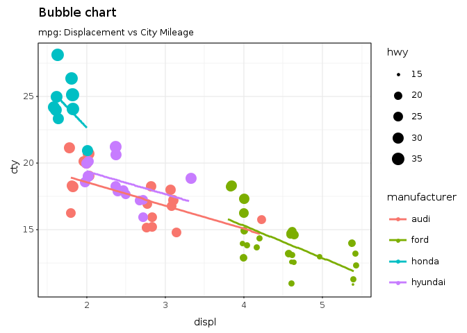
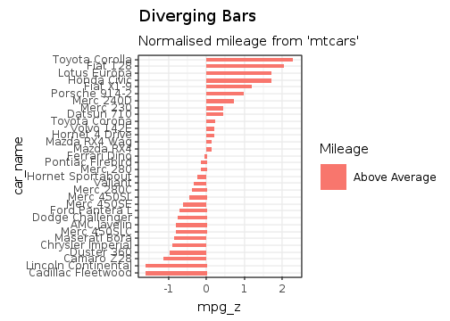

# Introduction

The idea of "literate programming" was first introduced by Donald Knuth in the 
1980's [@Knuth:literate_programming].
The main intention of this approach was to develop software interspersing macro snippets,
traditional source code, and a natural language such as English in a document 
that could be compiled into
executable code and at the same time easily read by a human developer. According to Knuth
"The practitioner of 
literate programming can be regarded as an essayist, whose main concern is with exposition 
and excellence of style."

The idea of literate programming evolved into the idea of reproducible research, in which
all the data, software code, documentation, graphics etc. needed to reproduce the research
and its reports could be included in a
single document or set of documents that when distributed to peers could be rerun generating
the same output and reports.

The R community has put a great deal of effort in reproducible research.  In 2002, Sweave was
introduced and it allowed mixing R code with LaTeX, generating high-quality PDF documents.  A
Sweave document could include code, the results of executing the code, graphics and text 
such that it contained the whole narrative to reproduce the research.  In
2012, Knitr, developed by Yihui Xie from RStudio was released to replace Sweave and to
consolidate in one single package the many extensions and add-on packages that
were necessary for Sweave.

With Knitr, __R markdown__ was also developed, an extension to the
Markdown format.  With __R markdown__ and Knitr it is possible to generate reports in a multitude
of formats such as HTML, Markdown, LaTeX, PDF, DVI, etc.  __R markdown__ also allows the use of
multiple programming languages such as R, Ruby, Python, etc. in the same document.  

In __R markdown__, text is interspersed with
code chunks that can be executed and both the code and its results can become
part of the final report.  Although __R markdown__ allows multiple programming languages in the
same document, only R and Python (with
the reticulate package) can persist variables between chunks.  For other languages, such as
Ruby, every chunk will start a new process and thus all data is lost between chunks, unless it
is somehow stored in a data file that is read by the next chunk.

Being able to persist data
between chunks is critical for literate programming otherwise the flow of the narrative is lost
by all the effort of having to save data and then reload it. Although this might, at first, seem like
a small nuisance, not being able to persist data between chunks is a major issue. For example, let's
take a look at the following simple example in which we want to show how to create a list and the
use it.  Let's first assume that data cannot be persisted between chunks.  In the next chunk we
create a list, then we would need to save it to file, but to save it, we need somehow to marshal the
data into a binary format:


``` ruby
lst = R.list(a: 1, b: 2, c: 3)
lst.saveRDS("lst.rds")
```
then, on the next chunk, where variable 'lst' is used, we need to read back it's value


``` ruby
lst = R.readRDS("lst.rds")
puts lst
```

```
## $a
## [1] 1
## 
## $b
## [1] 2
## 
## $c
## [1] 3
```

Now, any single code has dozens of variables that we might want to use and reuse between chunks.
Clearly, such an approach becomes quickly unmanageable. Probably, because of 
this problem, it is very rare to see any __R markdown__ document in the Ruby community.

When variables can be used accross chunks, then no overhead is needed:


``` ruby
lst = R.list(a: 1, b: 2, c: 3)
# any other code can be added here
```


``` ruby
puts lst
```

```
## $a
## [1] 1
## 
## $b
## [1] 2
## 
## $c
## [1] 3
```

In the Python community, the same effort to have code and text in an integrated environment
started around the first decade of the 2000s. In 2006 IPython 0.7.2 was released.  In 2014,
Fernando Pérez spun off the Jupyter project from IPython, creating a web-based interactive
computation environment.  Jupyter can now be used with many languages, including Ruby with the
iruby gem (https://github.com/SciRuby/iruby).  In order to have multiple languages in a Jupyter
notebook the SoS kernel was developed (https://vatlab.github.io/sos-docs/).

# gKnitting a Document

This document describes gKnit.  gKnit is based on knitr and __R markdown__ and can knit a document 
written both in Ruby and/or R and output it in any of the available formats of __R markdown__.  gKnit
allows ruby developers to do literate programming and reproducible research by allowing them to
have in a single document, text and code.

gKnit runs with **JRuby or CRuby**, **GNU R**, and **Galaaz** (the integration layer between Ruby and R—see below).
Knitr and **R Markdown** orchestrate the document; Galaaz’s engine keeps **Ruby state across chunks**
and talks to R through the **bridge**. Ruby chunks can read and update R variables (`~R[:name]`, `R.*`)
without GraalVM-style polyglot interop.

Galaaz has already been describe in the following posts:

* https://towardsdatascience.com/ruby-plotting-with-galaaz-an-example-of-tightly-coupling-ruby-and-r-in-graalvm-520b69e21021 (older GraalVM-era article; plotting ideas still apply).
* https://medium.freecodecamp.org/how-to-make-beautiful-ruby-plots-with-galaaz-320848058857

This is not a blog post on __R markdown__, and the interested user is directed to the following links
for detailed information on its capabilities and use.

* https://rmarkdown.rstudio.com/ or
* https://bookdown.org/yihui/rmarkdown/ 

In this post, we will describe just the main aspects of __R markdown__, so the user can start 
gKnitting Ruby and R documents quickly.

## The Yaml header

An __R markdown__ document should start with a Yaml header and be stored in a file with 
'.Rmd' extension. This document has the following header for gKnitting an HTML document.

```
---
title: "How to do reproducible research in Ruby with gKnit"
author: 
    - "Rodrigo Botafogo"
    - "Daniel Mossé - University of Pittsburgh"
tags: [Tech, Data Science, Ruby, R, JRuby, CRuby, "GNU R", Galaaz]
date: "20/02/2019"
output:
  html_document:
    self_contained: true
    keep_md: true
  pdf_document:
    includes:
      in_header: ["../../sty/galaaz.sty"]
    number_sections: yes
---
```

For more information on the options in the Yaml header, check https://bookdown.org/yihui/rmarkdown/html-document.html.

## __R Markdown__ formatting

Document formatting can be done with simple markups such as:

### Headers

```
# Header 1

## Header 2

### Header 3

```

### Lists

```
Unordered lists:

* Item 1
* Item 2
    + Item 2a
    + Item 2b
```

```
Ordered Lists

1. Item 1
2. Item 2
3. Item 3
    + Item 3a
    + Item 3b
```

For more R markdown formatting go to https://rmarkdown.rstudio.com/authoring_basics.html.

### R chunks

Running and executing Ruby and R code is actually what really interests us is this blog.  
Inserting a code chunk is done by adding code in a block delimited by three back ticks 
followed by an open
curly brace ('{') followed with the engine name (r, ruby, rb, include, ...), an 
any optional chunk_label and options, as shown below:

````
```{engine_name [chunk_label], [chunk_options]}
```
````

for instance, let's add an R chunk to the document labeled 'first_r_chunk'.  This is
a very simple code just to create a variable and print it out, as follows:

````
```{r first_r_chunk}
vec <- c(1, 2, 3)
print(vec)
```
````

If this block is added to an __R markdown__ document and gKnitted the result will be:


``` r
vec <- c(1, 2, 3)
print(vec)
```

```
## [1] 1 2 3
```

Now let's say that we want to do some analysis in the code, but just print the result and not the
code itself.  For this, we need to add the option 'echo = FALSE'.

````
```{r second_r_chunk, echo = FALSE}
vec2 <- c(10, 20, 30)
vec3 <- vec * vec2
print(vec3)     
```
````
Here is how this block will show up in the document. Observe that the code is not shown
and we only see the execution result in a white box


```
## [1] 10 40 90
```

A description of the available chunk options can be found in https://yihui.name/knitr/.

Let's add another R chunk with a function definition.  In this example, a vector 
'r_vec' is created and
a new function 'reduce_sum' is defined.  The chunk specification is

````
```{r data_creation}
r_vec <- c(1, 2, 3, 4, 5)

reduce_sum <- function(...) {
  Reduce(sum, as.list(...))
}
```
````

and this is how it will look like once executed.  From now on, to be concise in the
presentation we will not show chunk definitions any longer.


``` r
r_vec <- c(1, 2, 3, 4, 5)

reduce_sum <- function(...) {
  Reduce(sum, as.list(...))
}
```

We can, possibly in another chunk, access the vector and call the function as follows:


``` r
print(r_vec)
```

```
## [1] 1 2 3 4 5
```

``` r
print(reduce_sum(r_vec))
```

```
## [1] 15
```
### R Graphics with ggplot

In the following chunk, we create a bubble chart in R using ggplot and include it in 
this document.  Note that there is no directive in the code to include the image, this
occurs automatically.  The 'mpg' dataframe is natively available to R and to Galaaz as
well.

For the reader not knowledgeable of ggplot, ggplot is a graphics library based on "the
grammar of graphics" [@Wilkinson:grammar_of_graphics]. The idea of the grammar of graphics
is to build a graphics by adding layers to the plot.  More information can be found in
https://towardsdatascience.com/a-comprehensive-guide-to-the-grammar-of-graphics-for-effective-visualization-of-multi-dimensional-1f92b4ed4149.

In the plot below the 'mpg' dataset from base R is used. "The data concerns city-cycle fuel 
consumption in miles per gallon, to be predicted in terms of 3 multivalued discrete and 5 
continuous attributes." (Quinlan, 1993)

First, the 'mpg' dataset if filtered to extract only cars from the following manumactures: Audi, Ford,
Honda, and Hyundai and stored in the 'mpg_select' variable.  Then, the selected dataframe is passed
to the ggplot function specifying in the aesthetic method (aes) that 'displacement' (disp) should
be plotted in the 'x' axis and 'city mileage' should be on the 'y' axis.  In the 'labs' layer we
pass the 'title' and 'subtitle' for the plot.  To the basic plot 'g', geom\_jitter is added, that
plots cars from the same manufactures with the same color (col=manufactures) and the size of the
car point equal its high way consumption (size = hwy).  Finally, a last layer is plotter containing
a linear regression line (method = "lm") for every manufacturer.


``` r
# load package and data
library(ggplot2)
data(mpg, package="ggplot2")

mpg_select <- mpg[
  mpg$manufacturer %in% c("audi", "ford", "honda", "hyundai"),
]

# Scatterplot
theme_set(theme_bw())  # pre-set the bw theme.
g <- ggplot(mpg_select, aes(displ, cty)) +
  labs(subtitle="mpg: Displacement vs City Mileage",
       title="Bubble chart")

g + geom_jitter(aes(col=manufacturer, size=hwy)) +
  geom_smooth(aes(col=manufacturer), method="lm", se=F)
```

```
## `geom_smooth()` using formula = 'y ~ x'
```

<!-- -->

### Ruby chunks


Including a Ruby chunk is just as easy as including an R chunk in the document: just 
change the name of the engine to 'ruby'.  It is also possible to pass chunk options
to the Ruby engine; however, this version does not accept all the options that are
available to R chunks.  Future versions will add those options.

````
```{ruby first_ruby_chunk}
```
````

In this example, the ruby chunk is called 'first_ruby_chunk'.  One important 
aspect of chunk labels is that they cannot be duplicated.  If a chunk label is 
duplicated, gKnit will stop with an error.

In the following chunk, variable 'a', 'b' and 'c' are standard Ruby variables 
and 'vec' and 'vec2' are two vectors created  by calling the 'c' method on the 
R module.

In Galaaz, the R module allows us to access R functions transparently.  The 'c' 
function in R, is a function that concatenates its arguments making a vector.

It 
should be clear that there is no requirement in gknit to call or use any R 
functions.  gKnit will knit standard Ruby code, or even general text without 
any code.


``` ruby
a = [1, 2, 3]
b = "US$ 250.000"
c = "The 'outputs' function"

vec = R.c(1, 2, 3)
vec2 = R.c(10, 20, 30)
```

In the next block, variables 'a', 'vec' and 'vec2' are used and printed.


``` ruby
puts a
puts vec * vec2
```

```
## 1
## 2
## 3
## [1] 10 40 90
```

Note that 'a' is a standard Ruby Array and 'vec' and 'vec2' are vectors that behave accordingly,
where multiplication works as expected.


### Accessing R from Ruby

One of the nice aspects of Galaaz 2.0 is that variables and functions defined in R can
be easily accessed from Ruby.  This next chunk, reads data from R and uses the 'reduce_sum'
function defined previously.  To access an R variable from Ruby the '~' function should be
applied to the Ruby symbol representing the R variable.  Since the R variable is called 'r_vec',
in Ruby, the symbol to acess it is ':r_vec' and thus '~R[:r_vec]' retrieves the value of the
variable.


``` ruby
puts ~R[:r_vec]
```

```
## [1] 1 2 3 4 5
```

In order to call an R function, the 'R.' module is used as follows


``` ruby
puts R.reduce_sum(~R[:r_vec])
```

```
## [1] 15
```

### Ruby Plotting

We have seen an example of plotting with R.  Plotting with Ruby does not require
anything different from plotting with R.  In the following example, we plot a 
diverging bar graph using the 'mtcars' dataframe from R.  This data was extracted 
from the 1974 Motor Trend US magazine, and comprises fuel consumption and 10 aspects 
of automobile design and performance for 32 automobiles (1973–74 models).  The 
ten aspects are:

* mpg:	Miles/(US) gallon
* cyl:	Number of cylinders
* disp:	Displacement (cu.in.)
* hp:	Gross horsepower
* drat:	Rear axle ratio
* wt:	Weight (1000 lbs)
* qsec:	1/4 mile time
* vs:	Engine (0 = V-shaped, 1 = straight)
* am:	Transmission (0 = automatic, 1 = manual)
* gear:	Number of forward gears
* carb:	Number of carburetors


``` ruby
# copy the R variable :mtcars to the Ruby mtcars variable
mtcars = ~R[:mtcars]

# New column 'car_name' for plotting (rownames alone are not
# usable as plot data).
mtcars.car_name = R.rownames(:mtcars)

# Normalized mpg in column mpg_z: (mpg - mean) / sd, rounded.
mtcars.mpg_z =
  ((mtcars.mpg - mtcars.mpg.mean) / mtcars.mpg.sd).round 2

# mpg_type: 'below' if mpg_z < 0, else 'above' (vectorized ifelse).
mtcars.mpg_type =
  (mtcars.mpg_z < 0).ifelse("below", "above")

# Order rows by mpg_z ascending.
mtcars = mtcars[mtcars.mpg_z.order, :all]

# Factor car_name so plot keeps sorted order.
mtcars.car_name =
  mtcars.car_name.factor levels: mtcars.car_name

# First records of the final data frame
puts mtcars.head
```

```
##                      mpg cyl disp  hp drat    wt  qsec vs am gear
## Cadillac Fleetwood  10.4   8  472 205 2.93 5.250 17.98  0  0    3
## Lincoln Continental 10.4   8  460 215 3.00 5.424 17.82  0  0    3
## Camaro Z28          13.3   8  350 245 3.73 3.840 15.41  0  0    3
## Duster 360          14.3   8  360 245 3.21 3.570 15.84  0  0    3
## Chrysler Imperial   14.7   8  440 230 3.23 5.345 17.42  0  0    3
## Maserati Bora       15.0   8  301 335 3.54 3.570 14.60  0  1    5
##                     carb            car_name mpg_z mpg_type
## Cadillac Fleetwood     4  Cadillac Fleetwood -1.61    below
## Lincoln Continental    4 Lincoln Continental -1.61    below
## Camaro Z28             4          Camaro Z28 -1.13    below
## Duster 360             4          Duster 360 -0.96    below
## Chrysler Imperial      4   Chrysler Imperial -0.89    below
## Maserati Bora          8       Maserati Bora -0.84    below
```


``` ruby
require 'ggplot'

puts mtcars.ggplot(
       E.aes(x: :car_name, y: :mpg_z, label: :mpg_z)) +
     R.geom_bar(E.aes(fill: :mpg_type),
                stat: 'identity', width: 0.5) +
     R.scale_fill_manual(
       name: 'Mileage',
       labels: R.c('Above Average', 'Below Average'),
       values: R.c('above': '#00ba38',
                   'below': '#f8766d')) +
     R.labs(subtitle: "Normalised mileage from 'mtcars'",
            title: "Diverging Bars") +
     R.coord_flip
```




### Inline Ruby code

When using a Ruby chunk, the code and the output are formatted in blocks as seen above.
This formatting is not always desired.  Sometimes, we want to have the results of the
Ruby evaluation included in the middle of a phrase. gKnit allows adding inline Ruby code 
with the 'rb' engine.  The following chunk specification will 
create and inline Ruby text:

````
This is some text with inline Ruby accessing
variable 'b' which has value:
```{rb puts b}
```
and is followed by some other text!
````

<div style="margin-bottom:30px;">
</div>

This is some text with inline Ruby accessing variable 'b' which has value:
US$ 250.000
and is followed by some other text!

<div style="margin-bottom:30px;">
</div>

Note that it is important not to add any new line before of after the code
block if we want everything to be in only one line, resulting in the following sentence 
with inline Ruby code.


### The 'outputs' function

He have previously used the standard 'puts' method in Ruby chunks in order produce
output.  The result of a 'puts', as seen in all previous chunks that use it,  is formatted 
inside a white box that 
follows the code block. Many times however, we would like to do some processing in the 
Ruby chunk and have the result of this processing generate and output that is 
"included" in the document as if we had typed it in __R markdown__ document.

For example, suppose we want to create a new heading in our document, but the heading 
phrase is the result of some code processing: maybe it's the first line of a file we are
going to read.  Method 'outputs' adds its output as if typed in the __R markdown__ document. 

Take now a look at variable 'c' (it was defined in a previous block above) as 
'c = "The 'outputs' function".  "The 'outputs' function" is actually the name of this
section and it was created using the 'outputs' function inside a Ruby chunk.

The ruby chunk to generate this heading is:

````
```{ruby heading}
outputs "### #{c}"
```
````

The three '###' is the way we add a Heading 3 in __R markdown__.


### HTML Output from Ruby Chunks

We've just seen the use of method 'outputs' to add text to the the __R markdown__ 
document.  This technique can also be used to add HTML code to the document. In 
__R markdown__, any html code typed directly in the document will be properly rendered.  
Here, for instance, is a table definition in HTML and its output in the document:

```
<table style="width:100%">
  <tr>
    <th>Firstname</th>
    <th>Lastname</th> 
    <th>Age</th>
  </tr>
  <tr>
    <td>Jill</td>
    <td>Smith</td> 
    <td>50</td>
  </tr>
  <tr>
    <td>Eve</td>
    <td>Jackson</td> 
    <td>94</td>
  </tr>
</table>
```
<div style="margin-bottom:30px;">
</div>

<table style="width:100%">
  <tr>
    <th>Firstname</th>
    <th>Lastname</th> 
    <th>Age</th>
  </tr>
  <tr>
    <td>Jill</td>
    <td>Smith</td> 
    <td>50</td>
  </tr>
  <tr>
    <td>Eve</td>
    <td>Jackson</td> 
    <td>94</td>
  </tr>
</table>

<div style="margin-bottom:30px;">
</div>

But manually creating HTML output is not always easy or desirable, specially
if we intend the document to be rendered in other formats, for example, as LaTeX.
Also, The above 
table looks ugly.  The 'kableExtra' library is a great library for 
creating beautiful tables. Take a look at https://cran.r-project.org/web/packages/kableExtra/vignettes/awesome_table_in_html.html

In the next chunk, we output the 'mtcars' dataframe from R in a nicely formatted 
table.  Note that we retrieve the mtcars dataframe by using '~R[:mtcars]'.


``` ruby
R.install_and_loads('kableExtra')
outputs (~R[:mtcars]).kable.kable_styling
```

<table class="table" style="margin-left: auto; margin-right: auto;">
 <thead>
  <tr>
   <th style="text-align:left;">  </th>
   <th style="text-align:right;"> mpg </th>
   <th style="text-align:right;"> cyl </th>
   <th style="text-align:right;"> disp </th>
   <th style="text-align:right;"> hp </th>
   <th style="text-align:right;"> drat </th>
   <th style="text-align:right;"> wt </th>
   <th style="text-align:right;"> qsec </th>
   <th style="text-align:right;"> vs </th>
   <th style="text-align:right;"> am </th>
   <th style="text-align:right;"> gear </th>
   <th style="text-align:right;"> carb </th>
  </tr>
 </thead>
<tbody>
  <tr>
   <td style="text-align:left;"> Mazda RX4 </td>
   <td style="text-align:right;"> 21.0 </td>
   <td style="text-align:right;"> 6 </td>
   <td style="text-align:right;"> 160.0 </td>
   <td style="text-align:right;"> 110 </td>
   <td style="text-align:right;"> 3.90 </td>
   <td style="text-align:right;"> 2.620 </td>
   <td style="text-align:right;"> 16.46 </td>
   <td style="text-align:right;"> 0 </td>
   <td style="text-align:right;"> 1 </td>
   <td style="text-align:right;"> 4 </td>
   <td style="text-align:right;"> 4 </td>
  </tr>
  <tr>
   <td style="text-align:left;"> Mazda RX4 Wag </td>
   <td style="text-align:right;"> 21.0 </td>
   <td style="text-align:right;"> 6 </td>
   <td style="text-align:right;"> 160.0 </td>
   <td style="text-align:right;"> 110 </td>
   <td style="text-align:right;"> 3.90 </td>
   <td style="text-align:right;"> 2.875 </td>
   <td style="text-align:right;"> 17.02 </td>
   <td style="text-align:right;"> 0 </td>
   <td style="text-align:right;"> 1 </td>
   <td style="text-align:right;"> 4 </td>
   <td style="text-align:right;"> 4 </td>
  </tr>
  <tr>
   <td style="text-align:left;"> Datsun 710 </td>
   <td style="text-align:right;"> 22.8 </td>
   <td style="text-align:right;"> 4 </td>
   <td style="text-align:right;"> 108.0 </td>
   <td style="text-align:right;"> 93 </td>
   <td style="text-align:right;"> 3.85 </td>
   <td style="text-align:right;"> 2.320 </td>
   <td style="text-align:right;"> 18.61 </td>
   <td style="text-align:right;"> 1 </td>
   <td style="text-align:right;"> 1 </td>
   <td style="text-align:right;"> 4 </td>
   <td style="text-align:right;"> 1 </td>
  </tr>
  <tr>
   <td style="text-align:left;"> Hornet 4 Drive </td>
   <td style="text-align:right;"> 21.4 </td>
   <td style="text-align:right;"> 6 </td>
   <td style="text-align:right;"> 258.0 </td>
   <td style="text-align:right;"> 110 </td>
   <td style="text-align:right;"> 3.08 </td>
   <td style="text-align:right;"> 3.215 </td>
   <td style="text-align:right;"> 19.44 </td>
   <td style="text-align:right;"> 1 </td>
   <td style="text-align:right;"> 0 </td>
   <td style="text-align:right;"> 3 </td>
   <td style="text-align:right;"> 1 </td>
  </tr>
  <tr>
   <td style="text-align:left;"> Hornet Sportabout </td>
   <td style="text-align:right;"> 18.7 </td>
   <td style="text-align:right;"> 8 </td>
   <td style="text-align:right;"> 360.0 </td>
   <td style="text-align:right;"> 175 </td>
   <td style="text-align:right;"> 3.15 </td>
   <td style="text-align:right;"> 3.440 </td>
   <td style="text-align:right;"> 17.02 </td>
   <td style="text-align:right;"> 0 </td>
   <td style="text-align:right;"> 0 </td>
   <td style="text-align:right;"> 3 </td>
   <td style="text-align:right;"> 2 </td>
  </tr>
  <tr>
   <td style="text-align:left;"> Valiant </td>
   <td style="text-align:right;"> 18.1 </td>
   <td style="text-align:right;"> 6 </td>
   <td style="text-align:right;"> 225.0 </td>
   <td style="text-align:right;"> 105 </td>
   <td style="text-align:right;"> 2.76 </td>
   <td style="text-align:right;"> 3.460 </td>
   <td style="text-align:right;"> 20.22 </td>
   <td style="text-align:right;"> 1 </td>
   <td style="text-align:right;"> 0 </td>
   <td style="text-align:right;"> 3 </td>
   <td style="text-align:right;"> 1 </td>
  </tr>
  <tr>
   <td style="text-align:left;"> Duster 360 </td>
   <td style="text-align:right;"> 14.3 </td>
   <td style="text-align:right;"> 8 </td>
   <td style="text-align:right;"> 360.0 </td>
   <td style="text-align:right;"> 245 </td>
   <td style="text-align:right;"> 3.21 </td>
   <td style="text-align:right;"> 3.570 </td>
   <td style="text-align:right;"> 15.84 </td>
   <td style="text-align:right;"> 0 </td>
   <td style="text-align:right;"> 0 </td>
   <td style="text-align:right;"> 3 </td>
   <td style="text-align:right;"> 4 </td>
  </tr>
  <tr>
   <td style="text-align:left;"> Merc 240D </td>
   <td style="text-align:right;"> 24.4 </td>
   <td style="text-align:right;"> 4 </td>
   <td style="text-align:right;"> 146.7 </td>
   <td style="text-align:right;"> 62 </td>
   <td style="text-align:right;"> 3.69 </td>
   <td style="text-align:right;"> 3.190 </td>
   <td style="text-align:right;"> 20.00 </td>
   <td style="text-align:right;"> 1 </td>
   <td style="text-align:right;"> 0 </td>
   <td style="text-align:right;"> 4 </td>
   <td style="text-align:right;"> 2 </td>
  </tr>
  <tr>
   <td style="text-align:left;"> Merc 230 </td>
   <td style="text-align:right;"> 22.8 </td>
   <td style="text-align:right;"> 4 </td>
   <td style="text-align:right;"> 140.8 </td>
   <td style="text-align:right;"> 95 </td>
   <td style="text-align:right;"> 3.92 </td>
   <td style="text-align:right;"> 3.150 </td>
   <td style="text-align:right;"> 22.90 </td>
   <td style="text-align:right;"> 1 </td>
   <td style="text-align:right;"> 0 </td>
   <td style="text-align:right;"> 4 </td>
   <td style="text-align:right;"> 2 </td>
  </tr>
  <tr>
   <td style="text-align:left;"> Merc 280 </td>
   <td style="text-align:right;"> 19.2 </td>
   <td style="text-align:right;"> 6 </td>
   <td style="text-align:right;"> 167.6 </td>
   <td style="text-align:right;"> 123 </td>
   <td style="text-align:right;"> 3.92 </td>
   <td style="text-align:right;"> 3.440 </td>
   <td style="text-align:right;"> 18.30 </td>
   <td style="text-align:right;"> 1 </td>
   <td style="text-align:right;"> 0 </td>
   <td style="text-align:right;"> 4 </td>
   <td style="text-align:right;"> 4 </td>
  </tr>
  <tr>
   <td style="text-align:left;"> Merc 280C </td>
   <td style="text-align:right;"> 17.8 </td>
   <td style="text-align:right;"> 6 </td>
   <td style="text-align:right;"> 167.6 </td>
   <td style="text-align:right;"> 123 </td>
   <td style="text-align:right;"> 3.92 </td>
   <td style="text-align:right;"> 3.440 </td>
   <td style="text-align:right;"> 18.90 </td>
   <td style="text-align:right;"> 1 </td>
   <td style="text-align:right;"> 0 </td>
   <td style="text-align:right;"> 4 </td>
   <td style="text-align:right;"> 4 </td>
  </tr>
  <tr>
   <td style="text-align:left;"> Merc 450SE </td>
   <td style="text-align:right;"> 16.4 </td>
   <td style="text-align:right;"> 8 </td>
   <td style="text-align:right;"> 275.8 </td>
   <td style="text-align:right;"> 180 </td>
   <td style="text-align:right;"> 3.07 </td>
   <td style="text-align:right;"> 4.070 </td>
   <td style="text-align:right;"> 17.40 </td>
   <td style="text-align:right;"> 0 </td>
   <td style="text-align:right;"> 0 </td>
   <td style="text-align:right;"> 3 </td>
   <td style="text-align:right;"> 3 </td>
  </tr>
  <tr>
   <td style="text-align:left;"> Merc 450SL </td>
   <td style="text-align:right;"> 17.3 </td>
   <td style="text-align:right;"> 8 </td>
   <td style="text-align:right;"> 275.8 </td>
   <td style="text-align:right;"> 180 </td>
   <td style="text-align:right;"> 3.07 </td>
   <td style="text-align:right;"> 3.730 </td>
   <td style="text-align:right;"> 17.60 </td>
   <td style="text-align:right;"> 0 </td>
   <td style="text-align:right;"> 0 </td>
   <td style="text-align:right;"> 3 </td>
   <td style="text-align:right;"> 3 </td>
  </tr>
  <tr>
   <td style="text-align:left;"> Merc 450SLC </td>
   <td style="text-align:right;"> 15.2 </td>
   <td style="text-align:right;"> 8 </td>
   <td style="text-align:right;"> 275.8 </td>
   <td style="text-align:right;"> 180 </td>
   <td style="text-align:right;"> 3.07 </td>
   <td style="text-align:right;"> 3.780 </td>
   <td style="text-align:right;"> 18.00 </td>
   <td style="text-align:right;"> 0 </td>
   <td style="text-align:right;"> 0 </td>
   <td style="text-align:right;"> 3 </td>
   <td style="text-align:right;"> 3 </td>
  </tr>
  <tr>
   <td style="text-align:left;"> Cadillac Fleetwood </td>
   <td style="text-align:right;"> 10.4 </td>
   <td style="text-align:right;"> 8 </td>
   <td style="text-align:right;"> 472.0 </td>
   <td style="text-align:right;"> 205 </td>
   <td style="text-align:right;"> 2.93 </td>
   <td style="text-align:right;"> 5.250 </td>
   <td style="text-align:right;"> 17.98 </td>
   <td style="text-align:right;"> 0 </td>
   <td style="text-align:right;"> 0 </td>
   <td style="text-align:right;"> 3 </td>
   <td style="text-align:right;"> 4 </td>
  </tr>
  <tr>
   <td style="text-align:left;"> Lincoln Continental </td>
   <td style="text-align:right;"> 10.4 </td>
   <td style="text-align:right;"> 8 </td>
   <td style="text-align:right;"> 460.0 </td>
   <td style="text-align:right;"> 215 </td>
   <td style="text-align:right;"> 3.00 </td>
   <td style="text-align:right;"> 5.424 </td>
   <td style="text-align:right;"> 17.82 </td>
   <td style="text-align:right;"> 0 </td>
   <td style="text-align:right;"> 0 </td>
   <td style="text-align:right;"> 3 </td>
   <td style="text-align:right;"> 4 </td>
  </tr>
  <tr>
   <td style="text-align:left;"> Chrysler Imperial </td>
   <td style="text-align:right;"> 14.7 </td>
   <td style="text-align:right;"> 8 </td>
   <td style="text-align:right;"> 440.0 </td>
   <td style="text-align:right;"> 230 </td>
   <td style="text-align:right;"> 3.23 </td>
   <td style="text-align:right;"> 5.345 </td>
   <td style="text-align:right;"> 17.42 </td>
   <td style="text-align:right;"> 0 </td>
   <td style="text-align:right;"> 0 </td>
   <td style="text-align:right;"> 3 </td>
   <td style="text-align:right;"> 4 </td>
  </tr>
  <tr>
   <td style="text-align:left;"> Fiat 128 </td>
   <td style="text-align:right;"> 32.4 </td>
   <td style="text-align:right;"> 4 </td>
   <td style="text-align:right;"> 78.7 </td>
   <td style="text-align:right;"> 66 </td>
   <td style="text-align:right;"> 4.08 </td>
   <td style="text-align:right;"> 2.200 </td>
   <td style="text-align:right;"> 19.47 </td>
   <td style="text-align:right;"> 1 </td>
   <td style="text-align:right;"> 1 </td>
   <td style="text-align:right;"> 4 </td>
   <td style="text-align:right;"> 1 </td>
  </tr>
  <tr>
   <td style="text-align:left;"> Honda Civic </td>
   <td style="text-align:right;"> 30.4 </td>
   <td style="text-align:right;"> 4 </td>
   <td style="text-align:right;"> 75.7 </td>
   <td style="text-align:right;"> 52 </td>
   <td style="text-align:right;"> 4.93 </td>
   <td style="text-align:right;"> 1.615 </td>
   <td style="text-align:right;"> 18.52 </td>
   <td style="text-align:right;"> 1 </td>
   <td style="text-align:right;"> 1 </td>
   <td style="text-align:right;"> 4 </td>
   <td style="text-align:right;"> 2 </td>
  </tr>
  <tr>
   <td style="text-align:left;"> Toyota Corolla </td>
   <td style="text-align:right;"> 33.9 </td>
   <td style="text-align:right;"> 4 </td>
   <td style="text-align:right;"> 71.1 </td>
   <td style="text-align:right;"> 65 </td>
   <td style="text-align:right;"> 4.22 </td>
   <td style="text-align:right;"> 1.835 </td>
   <td style="text-align:right;"> 19.90 </td>
   <td style="text-align:right;"> 1 </td>
   <td style="text-align:right;"> 1 </td>
   <td style="text-align:right;"> 4 </td>
   <td style="text-align:right;"> 1 </td>
  </tr>
  <tr>
   <td style="text-align:left;"> Toyota Corona </td>
   <td style="text-align:right;"> 21.5 </td>
   <td style="text-align:right;"> 4 </td>
   <td style="text-align:right;"> 120.1 </td>
   <td style="text-align:right;"> 97 </td>
   <td style="text-align:right;"> 3.70 </td>
   <td style="text-align:right;"> 2.465 </td>
   <td style="text-align:right;"> 20.01 </td>
   <td style="text-align:right;"> 1 </td>
   <td style="text-align:right;"> 0 </td>
   <td style="text-align:right;"> 3 </td>
   <td style="text-align:right;"> 1 </td>
  </tr>
  <tr>
   <td style="text-align:left;"> Dodge Challenger </td>
   <td style="text-align:right;"> 15.5 </td>
   <td style="text-align:right;"> 8 </td>
   <td style="text-align:right;"> 318.0 </td>
   <td style="text-align:right;"> 150 </td>
   <td style="text-align:right;"> 2.76 </td>
   <td style="text-align:right;"> 3.520 </td>
   <td style="text-align:right;"> 16.87 </td>
   <td style="text-align:right;"> 0 </td>
   <td style="text-align:right;"> 0 </td>
   <td style="text-align:right;"> 3 </td>
   <td style="text-align:right;"> 2 </td>
  </tr>
  <tr>
   <td style="text-align:left;"> AMC Javelin </td>
   <td style="text-align:right;"> 15.2 </td>
   <td style="text-align:right;"> 8 </td>
   <td style="text-align:right;"> 304.0 </td>
   <td style="text-align:right;"> 150 </td>
   <td style="text-align:right;"> 3.15 </td>
   <td style="text-align:right;"> 3.435 </td>
   <td style="text-align:right;"> 17.30 </td>
   <td style="text-align:right;"> 0 </td>
   <td style="text-align:right;"> 0 </td>
   <td style="text-align:right;"> 3 </td>
   <td style="text-align:right;"> 2 </td>
  </tr>
  <tr>
   <td style="text-align:left;"> Camaro Z28 </td>
   <td style="text-align:right;"> 13.3 </td>
   <td style="text-align:right;"> 8 </td>
   <td style="text-align:right;"> 350.0 </td>
   <td style="text-align:right;"> 245 </td>
   <td style="text-align:right;"> 3.73 </td>
   <td style="text-align:right;"> 3.840 </td>
   <td style="text-align:right;"> 15.41 </td>
   <td style="text-align:right;"> 0 </td>
   <td style="text-align:right;"> 0 </td>
   <td style="text-align:right;"> 3 </td>
   <td style="text-align:right;"> 4 </td>
  </tr>
  <tr>
   <td style="text-align:left;"> Pontiac Firebird </td>
   <td style="text-align:right;"> 19.2 </td>
   <td style="text-align:right;"> 8 </td>
   <td style="text-align:right;"> 400.0 </td>
   <td style="text-align:right;"> 175 </td>
   <td style="text-align:right;"> 3.08 </td>
   <td style="text-align:right;"> 3.845 </td>
   <td style="text-align:right;"> 17.05 </td>
   <td style="text-align:right;"> 0 </td>
   <td style="text-align:right;"> 0 </td>
   <td style="text-align:right;"> 3 </td>
   <td style="text-align:right;"> 2 </td>
  </tr>
  <tr>
   <td style="text-align:left;"> Fiat X1-9 </td>
   <td style="text-align:right;"> 27.3 </td>
   <td style="text-align:right;"> 4 </td>
   <td style="text-align:right;"> 79.0 </td>
   <td style="text-align:right;"> 66 </td>
   <td style="text-align:right;"> 4.08 </td>
   <td style="text-align:right;"> 1.935 </td>
   <td style="text-align:right;"> 18.90 </td>
   <td style="text-align:right;"> 1 </td>
   <td style="text-align:right;"> 1 </td>
   <td style="text-align:right;"> 4 </td>
   <td style="text-align:right;"> 1 </td>
  </tr>
  <tr>
   <td style="text-align:left;"> Porsche 914-2 </td>
   <td style="text-align:right;"> 26.0 </td>
   <td style="text-align:right;"> 4 </td>
   <td style="text-align:right;"> 120.3 </td>
   <td style="text-align:right;"> 91 </td>
   <td style="text-align:right;"> 4.43 </td>
   <td style="text-align:right;"> 2.140 </td>
   <td style="text-align:right;"> 16.70 </td>
   <td style="text-align:right;"> 0 </td>
   <td style="text-align:right;"> 1 </td>
   <td style="text-align:right;"> 5 </td>
   <td style="text-align:right;"> 2 </td>
  </tr>
  <tr>
   <td style="text-align:left;"> Lotus Europa </td>
   <td style="text-align:right;"> 30.4 </td>
   <td style="text-align:right;"> 4 </td>
   <td style="text-align:right;"> 95.1 </td>
   <td style="text-align:right;"> 113 </td>
   <td style="text-align:right;"> 3.77 </td>
   <td style="text-align:right;"> 1.513 </td>
   <td style="text-align:right;"> 16.90 </td>
   <td style="text-align:right;"> 1 </td>
   <td style="text-align:right;"> 1 </td>
   <td style="text-align:right;"> 5 </td>
   <td style="text-align:right;"> 2 </td>
  </tr>
  <tr>
   <td style="text-align:left;"> Ford Pantera L </td>
   <td style="text-align:right;"> 15.8 </td>
   <td style="text-align:right;"> 8 </td>
   <td style="text-align:right;"> 351.0 </td>
   <td style="text-align:right;"> 264 </td>
   <td style="text-align:right;"> 4.22 </td>
   <td style="text-align:right;"> 3.170 </td>
   <td style="text-align:right;"> 14.50 </td>
   <td style="text-align:right;"> 0 </td>
   <td style="text-align:right;"> 1 </td>
   <td style="text-align:right;"> 5 </td>
   <td style="text-align:right;"> 4 </td>
  </tr>
  <tr>
   <td style="text-align:left;"> Ferrari Dino </td>
   <td style="text-align:right;"> 19.7 </td>
   <td style="text-align:right;"> 6 </td>
   <td style="text-align:right;"> 145.0 </td>
   <td style="text-align:right;"> 175 </td>
   <td style="text-align:right;"> 3.62 </td>
   <td style="text-align:right;"> 2.770 </td>
   <td style="text-align:right;"> 15.50 </td>
   <td style="text-align:right;"> 0 </td>
   <td style="text-align:right;"> 1 </td>
   <td style="text-align:right;"> 5 </td>
   <td style="text-align:right;"> 6 </td>
  </tr>
  <tr>
   <td style="text-align:left;"> Maserati Bora </td>
   <td style="text-align:right;"> 15.0 </td>
   <td style="text-align:right;"> 8 </td>
   <td style="text-align:right;"> 301.0 </td>
   <td style="text-align:right;"> 335 </td>
   <td style="text-align:right;"> 3.54 </td>
   <td style="text-align:right;"> 3.570 </td>
   <td style="text-align:right;"> 14.60 </td>
   <td style="text-align:right;"> 0 </td>
   <td style="text-align:right;"> 1 </td>
   <td style="text-align:right;"> 5 </td>
   <td style="text-align:right;"> 8 </td>
  </tr>
  <tr>
   <td style="text-align:left;"> Volvo 142E </td>
   <td style="text-align:right;"> 21.4 </td>
   <td style="text-align:right;"> 4 </td>
   <td style="text-align:right;"> 121.0 </td>
   <td style="text-align:right;"> 109 </td>
   <td style="text-align:right;"> 4.11 </td>
   <td style="text-align:right;"> 2.780 </td>
   <td style="text-align:right;"> 18.60 </td>
   <td style="text-align:right;"> 1 </td>
   <td style="text-align:right;"> 1 </td>
   <td style="text-align:right;"> 4 </td>
   <td style="text-align:right;"> 2 </td>
  </tr>
</tbody>
</table>

### Including Ruby files in a chunk

R is a language that was created to be easy and fast for statisticians to use.  As far
as I know, it was not a
language to be used for developing large systems.  Of course, there are large systems and
libraries in R, but the focus of the language is for developing statistical models and
distribute that to peers.

Ruby on the other hand, is a language for large software development.  Systems written in
Ruby will have dozens, hundreds or even thousands of files.  To document a 
large system with literate programming, we cannot expect the developer to add all the 
files in a single '.Rmd' file.  gKnit provides the 'include' chunk engine to include 
a Ruby file as if it had being typed in the '.Rmd' file.

To include a file, the following chunk should be created, where <filename> is the name of
the file to be included and where the extension, if it is '.rb', does not need to be added.
If the 'relative' option is not included, then it is treated as TRUE.  When 'relative' is
true, ruby's 'require\_relative' semantics is used to load the file, when false, Ruby's 
\$LOAD_PATH is searched to find the file and it is 'require'd.

````
```{include <filename>, relative = <TRUE/FALSE>}
```
````

Below we include file 'model.rb', which is in the same directory of this blog.  
This code uses R 'caret' package to split a dataset in a train and test sets.
The 'caret' package is a very important a useful package for doing Data Analysis,
it has hundreds of functions for all steps of the Data Analysis workflow.  To
use 'caret' just to split a dataset is like using the proverbial cannon to 
kill the fly.  We use it here only to show that integrating Ruby and R and 
using even a very complex package as 'caret' is trivial with Galaaz.

A word of advice: the 'caret' package has lots of dependencies and installing
it in a Linux system is a time consuming operation.  Method 'R.install_and_loads'
will install the package if it is not already installed (via **`R::Job`**: a child
`Rscript`, so the bridge stays free) and can take a while.

````
```{include model}
```
````


``` include
require 'galaaz'

# Loads the R 'caret' package.  If not present, installs it 
R.install_and_loads 'caret'

class Model
  
  attr_reader :data
  attr_reader :test
  attr_reader :train

  #==========================================================
  #
  #==========================================================
  
  def initialize(data, percent_train:, seed: 123)

    R.set__seed(seed)
    @data = data
    @percent_train = percent_train
    @seed = seed
    
  end

  #==========================================================
  #
  #==========================================================

  def partition(field)

    train_index =
      R.createDataPartition(@data.send(field), p: @percent_train,
                            list: false, times: 1)
    @train = @data[train_index, :all]
    @test = @data[-train_index, :all]
    
  end
  
end
```


``` ruby
mtcars = ~R[:mtcars]
model = Model.new(mtcars, percent_train: 0.8)
model.partition(:mpg)
puts model.train.head
puts model.test.head
```

```
##                    mpg cyl  disp  hp drat    wt  qsec vs am gear carb
## Mazda RX4         21.0   6 160.0 110 3.90 2.620 16.46  0  1    4    4
## Datsun 710        22.8   4 108.0  93 3.85 2.320 18.61  1  1    4    1
## Hornet 4 Drive    21.4   6 258.0 110 3.08 3.215 19.44  1  0    3    1
## Hornet Sportabout 18.7   8 360.0 175 3.15 3.440 17.02  0  0    3    2
## Valiant           18.1   6 225.0 105 2.76 3.460 20.22  1  0    3    1
## Merc 240D         24.4   4 146.7  62 3.69 3.190 20.00  1  0    4    2
##                 mpg cyl  disp  hp drat    wt  qsec vs am gear carb
## Mazda RX4 Wag  21.0   6 160.0 110 3.90 2.875 17.02  0  1    4    4
## Duster 360     14.3   8 360.0 245 3.21 3.570 15.84  0  0    3    4
## Toyota Corolla 33.9   4  71.1  65 4.22 1.835 19.90  1  1    4    1
## Ford Pantera L 15.8   8 351.0 264 4.22 3.170 14.50  0  1    5    4
```

### Documenting Gems

gKnit also allows developers to document and load files that are not in the same directory
of the '.Rmd' file.

Here is an example of loading the 'find.rb' file from Ruby (via `$LOAD_PATH`). In this example, relative
is set to FALSE, so Ruby will look for the file in its $LOAD\_PATH, and the user does not
need to know its directory.

````
```{include find, relative = FALSE}
```
````


``` include
# frozen_string_literal: true
#
# find.rb: the Find module for processing all files under a given directory.
#

#
# The +Find+ module supports the top-down traversal of a set of file paths.
#
# For example, to total the size of all files under your home directory,
# ignoring anything in a "dot" directory (e.g. $HOME/.ssh):
#
#   require 'find'
#
#   total_size = 0
#
#   Find.find(ENV["HOME"]) do |path|
#     if FileTest.directory?(path)
#       if File.basename(path).start_with?('.')
#         Find.prune       # Don't look any further into this directory.
#       else
#         next
#       end
#     else
#       total_size += FileTest.size(path)
#     end
#   end
#
module Find

  VERSION = "0.2.0"

  #
  # Calls the associated block with the name of every file and directory listed
  # as arguments, then recursively on their subdirectories, and so on.
  #
  # Returns an enumerator if no block is given.
  #
  # See the +Find+ module documentation for an example.
  #
  def find(*paths, ignore_error: true) # :yield: path
    block_given? or return enum_for(__method__, *paths, ignore_error: ignore_error)

    fs_encoding = Encoding.find("filesystem")

    paths.collect!{|d| raise Errno::ENOENT, d unless File.exist?(d); d.dup}.each do |path|
      path = path.to_path if path.respond_to? :to_path
      enc = path.encoding == Encoding::US_ASCII ? fs_encoding : path.encoding
      ps = [path]
      while file = ps.shift
        catch(:prune) do
          yield file.dup
          begin
            s = File.lstat(file)
          rescue Errno::ENOENT, Errno::EACCES, Errno::ENOTDIR, Errno::ELOOP, Errno::ENAMETOOLONG, Errno::EINVAL
            raise unless ignore_error
            next
          end
          if s.directory? then
            begin
              fs = Dir.children(file, encoding: enc)
            rescue Errno::ENOENT, Errno::EACCES, Errno::ENOTDIR, Errno::ELOOP, Errno::ENAMETOOLONG, Errno::EINVAL
              raise unless ignore_error
              next
            end
            fs.sort!
            fs.reverse_each {|f|
              f = File.join(file, f)
              ps.unshift f
            }
          end
        end
      end
    end
    nil
  end

  #
  # Skips the current file or directory, restarting the loop with the next
  # entry. If the current file is a directory, that directory will not be
  # recursively entered. Meaningful only within the block associated with
  # Find::find.
  #
  # See the +Find+ module documentation for an example.
  #
  def prune
    throw :prune
  end

  module_function :find, :prune
end
```

## Converting to PDF

One of the beauties of knitr is that the same input can be converted to many different outputs.
One very useful format, is, of course, PDF.  In order to converted an __R markdown__ file to PDF
it is necessary to have LaTeX installed on the system.  We will not explain here how to
install LaTeX as there are plenty of documents on the web showing how to proceed.

gKnit comes with a simple LaTeX style file for gknitting this blog as a PDF document.  Here is
the Yaml header to generate this blog in PDF format instead of HTML:

```
---
title: "gKnit - Ruby and R Knitting with Galaaz"
author: "Rodrigo Botafogo"
tags: [Galaaz, Ruby, R, JRuby, CRuby, "GNU R", knitr, gknit]
date: "29 October 2018"
output:
  pdf\_document:
    includes:
      in\_header: ["../../sty/galaaz.sty"]
    number\_sections: yes
---
```


# Conclusion

In order to do reproducible research, one of the main basic tools needed is a system that
allows "literate programming" where text, code and possibly a set of files can be compiled
onto a report that can be easily distributed to peers. Peers should be able to use this
same set of files to rerun the compilation by their own obtaining the exact same original
report.  gKnit is such a system for Ruby and R.  It uses __R Markdown__ to integrate
text and code chunks, where code chunks can either be part of the __R Markdown__ file or
be imported from files in the system.  Ideally, in reproducible research, all the files
needed to rebuild a report should be easily packed together (in the same zipped directory)
and distributed to peers for reexecution.

**Galaaz 2.0** pairs **JRuby or CRuby** with **GNU R**: you keep the full CRAN/Bioconductor world in R while
writing orchestration, reuse, and application code in Ruby. The effort to wrap Ruby over R (Galaaz)
and to wrap Knitr as gKnit was tiny compared to reimplementing R’s ecosystem in Ruby—much like
Python’s investment in NumPy and Pandas, which no Ruby project is likely to duplicate.

An **earlier** prototype used Oracle’s **GraalVM** and Truffle interop; the **current** stack is
deliberately **standard GNU R** plus the Galaaz **bridge** on JRuby or CRuby, documented in the project manual.

More interesting than wrapping the R libraries with Ruby, is that Ruby adds
value to R, by allowing developers to use powerful and modern constructs for code reuse that
are not the strong points of R.  As shown in this blog, R and Ruby can easily communicate
and R can be structured in classes and modules in a way that greatly expands its power and
readability.

# Installing gKnit

## Prerequisites (Galaaz 2.0)

* **JRuby** and a compatible **JDK**, *or* **CRuby 3.3+**
* **GNU R** on your `PATH`

The following R packages will be automatically installed when necessary, but could be installed prior
to using gKnit if desired:

* ggplot2
* gridExtra
* knitr

Installation of R packages requires a development environment and can be time consuming.  On Linux,
the usual build tools are typically enough.  On macOS, Xcode command-line tools are commonly required.

## Preparation

* Install the **galaaz** gem (RubyGems or a local build / `path:`).

## Usage

* **`bin/gknit`** \<filename\> (from the Galaaz repo or your install layout); use **`--output_format all`** for HTML and PDF together.
* Run Ruby with **`bin/galaaz-ruby`** (either engine) or **`bin/galaaz-jruby`** when you need JRuby JVM flags (see the manual).


# References

