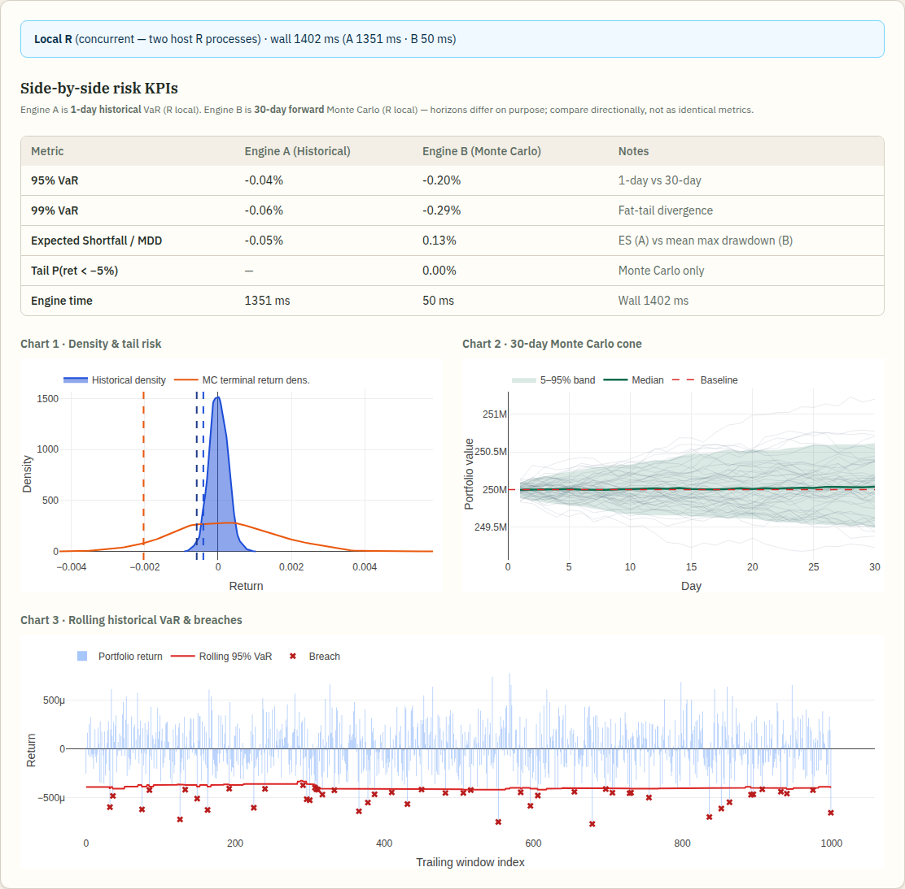
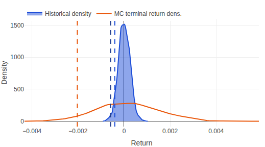
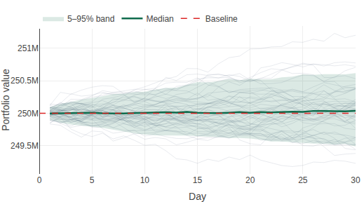
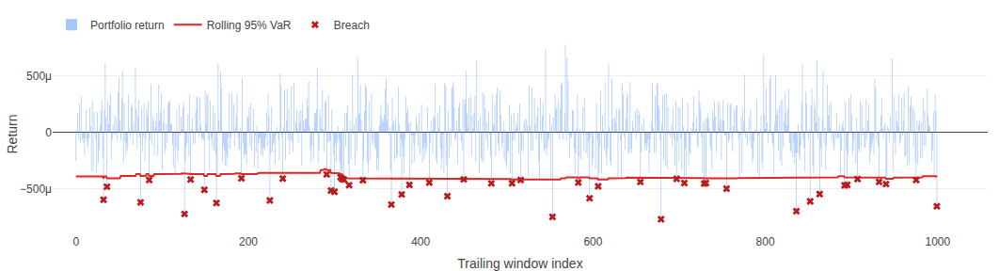

```{r setup, echo=FALSE}
options(width = 70)
knitr::opts_chunk$set(fig.path = "r_on_rails_ledger_files/figure-")
```

```{ruby setup_ruby, echo=FALSE}
ENV['GALAAZ_BRIDGE_TIMEOUT_SEC'] ||= '300'
ENV['GALAAZ_JOBS_DIR'] ||=
  File.join(Dir.tmpdir, 'galaaz_jobs_ledger_blog')
R.options(crayon__enabled: false, width: 70)
```

# Two audiences, one gap

**If you live in R**, you already have the hard part: VaR, density
estimates, Monte Carlo, Bioconductor, the whole CRAN catalog. What is
still painful is turning a notebook into a **product**—logins, a
database, background jobs, a page that updates when the job finishes,
and a deploy story that is not a pile of glue scripts.

**If you live in Ruby on Rails**, you already have the product shell.
What is still painful is serious statistics without standing up a
Python microservice fleet, learning another ORM, and ferrying CSV
files between processes.

**R-on-Rails** is the name we give to a simple division of labor:

* **Rails** owns HTTP, Active Record, jobs, Hotwire, and the UX.
* **GNU R** owns the math and the statistical vocabulary.
* **[Galaaz](https://github.com/rbotafogo/galaaz)** is the bridge that
  makes R feel like a Ruby DSL—and moves bulky tables with Apache
  Arrow when you need more than a few numbers.

This post walks through a real demo app—the
**[R-on-Rails Ledger](https://github.com/rbotafogo/r_on_rails_ledger)**—
so you can see the database, the calculators, and the charts on one
page.

# What the Ledger is

The Ledger is a **family-office style portfolio stress tester** on
**Rails 8**, **CRuby**, **SQLite**, **Solid Queue / Solid Cable**, and
**Hotwire**. It is a sibling app to the Galaaz gem (not packaged inside
the gem). One click runs two engines on the same portfolio return
panel:

* **Engine A — historical:** empirical VaR / expected shortfall /
  return density from history (`R.quantile`, `R.mean`, `R.density`).
* **Engine B — Monte Carlo:** forward GBM paths calibrated to that
  history, then forward VaR-style KPIs and a 30-day “cone.”

Rails stores the book and the job results; R does the science; the
browser gets Plotly charts from JSON that R (and a little Ruby)
produced.

# What’s in Rails (and the database)

The “ledger” here is a **portfolio price book**, not double-entry
accounting:

| Table | Role |
|---|---|
| `portfolios` | Named book (`name`, `total_value`) |
| `assets` | Tickers + weights |
| `historical_prices` | Bars: `adjusted_close`, `daily_return`, ... |
| `stress_tests` | Job status, scalar KPIs, `chart_payload` JSON |
| `stress_test_runs` | Per-engine (`historical` / `monte_carlo`) payloads |

Seed data is **synthetic GBM** (honest demo data—not a live feed).
`SEED_PROFILE=fast` is laptop-friendly (~10 assets x 2k bars);
`SEED_PROFILE=wow` is the “about a million bars” line.

The click path is ordinary Rails:

```text
POST /portfolios/:id/stress_tests
  -> StressTestsController#create
  -> StressTestJob.perform_later(...)
  -> Risk::DualOrchestrator
       |- Risk::HistoricalEngine
       |- Risk::MonteCarloEngine
  -> Turbo::StreamsChannel broadcast
  -> results partial + Plotly redraw
```

No React SPA. No Redis required for the demo. Development often runs
the job **`:async`** in-process so one `bin/dev` is enough; Solid Queue
stays in the Gemfile for production-shaped runs.

# R calculators that read like Ruby

After returns land in R (via Arrow—see below), the historical engine
exposes small methods that call R the way Galaaz intends: **named
functions and vectors**, not a wall of quoted R source for every KPI.

From the Ledger’s `Risk::HistoricalEngine` (abbreviated):

```ruby
def historical_var(returns_vec, probs:)
  RValues.scalar_f(
    R.as__numeric(
      R.quantile(returns_vec,
                 probs: probs,
                 names: false,
                 type: 7)
    )
  )
end

def expected_shortfall(returns_vec, var_level)
  thr = var_level.is_a?(Numeric) ?
    var_level : RValues.scalar_f(var_level)
  RValues.scalar_f(
    R.as__numeric(
      R.mean(returns_vec[returns_vec <= thr])
    )
  )
end

def return_density(returns_vec, n: 128)
  ArrowHandoff.density_xy_for_plotly(returns_vec, n: n)
end
```

That is the pitch for Ruby developers: `R.quantile` is a method call.
For R developers: the quantile is still **R’s** quantile—same
`type = 7` story you know—just invoked from the app that owns the
database.

A tiny live taste of the same idea (outside Rails):

```{ruby quantile_hello, message=FALSE, warning=FALSE}
x = R.c(-0.02, -0.01, 0.0, 0.01, 0.015, -0.005)
q05 = R.as__numeric(
  R.quantile(x, probs: 0.05, names: false, type: 7))
puts "5% quantile: #{q05 >> 0}"
```

Engine B calibrates mu/sigma in R, simulates GBM paths, and returns
structured fields (`sim_var_30d`, sample paths, terminal density)
that Rails stores on each run’s `payload` JSON.

# How data moves (Arrow, honestly)

Crossing a process boundary means you must be honest about **copies**.
Galaaz can move columnar data with Apache Arrow in three ways:

1. **Copy into R** — Ruby builds batches; R materialises an Arrow
   table / proxy. Simple and available today.
2. **IPC file handoff** — Ruby writes an Arrow IPC file (often under
   `/dev/shm`); R opens it by **path**. Only the path crosses
   NewBridge—not megabytes of MsgPack. This is what the Ledger
   prefers for the return panel.
3. **Shared-memory zero-copy** — both processes attach to one live
   segment. **Not implemented yet**; we do not claim it.

## Example: copy into R

Good when the table is modest or you do not have a Ruby Arrow writer
installed. One call builds the R-side table; then you Remote-Control
it.

```{ruby arrow_copy, message=FALSE, warning=FALSE}
arrow_ok = R::Support.eval(
  "requireNamespace('arrow', quietly=TRUE)") == true
unless arrow_ok
  puts '(Skip: need R package arrow.)'
else
  batches = [
    [{ daily_return: -0.01 }, { daily_return: 0.02 }],
    [{ daily_return: 0.005 }, { daily_return: -0.003 }]
  ]
  tbl = R::Arrow.from_ruby_batches(batches)
  puts "R class: #{tbl.rclass}"
  vec = R.as__numeric(
    R.dplyr___collect(tbl)[['daily_return']])
  q05 = R.as__numeric(
    R.quantile(vec, probs: 0.05, names: false, type: 7))
  puts "5% quantile: #{q05 >> 0}"
end
```

The Ledger’s fallback path is similar: a small `data.frame` plus
`R::Arrow.table_from(df)` when IPC is unavailable.

## Example: IPC file handoff

Preferred for larger same-machine panels. Ruby writes the file; R
opens by path; Ruby can unlink after R has the table. The reverse
direction (`R::Arrow.write_ipc` then `Galaaz::ArrowIpc.read`) is how
the Ledger can pull density coordinates back for Plotly.

```{ruby arrow_ipc, message=FALSE, warning=FALSE}
ipc_ok = Galaaz::ArrowIpc.available? &&
  (R::Support.eval(
    "requireNamespace('arrow', quietly=TRUE)") == true)
unless ipc_ok
  puts '(Skip: need Arrow IPC backend + R arrow.)'
else
  returns = [-0.01, 0.02, 0.005, -0.003, -0.008]
  path = Galaaz::ArrowIpc.write(
    'daily_return' => returns.map(&:to_f))
  begin
    tbl = R::Arrow.open_ipc(path)
    puts "R class: #{tbl.rclass}"
    puts "IPC: #{File.basename(path)}"
    vec = R.as__numeric(
      R.dplyr___collect(tbl)[['daily_return']])
    q05 = R.as__numeric(
      R.quantile(vec, probs: 0.05, names: false, type: 7))
    puts "5% quantile: #{q05 >> 0}"
  ensure
    Galaaz::ArrowIpc.release(path)
  end
end
```

Then the product rule is **Remote Control**: keep the heavy panel in
R; unbox **KPIs and chart coordinates** back to Ruby for SQLite and
the browser.

```text
SQLite -> portfolio return series (Ruby)
      -> Arrow IPC file (path on the bridge)
      -> GNU R (quantile / density / GBM)
      -> JSON-ish payloads on SQLite
      -> Turbo Stream -> Stimulus -> Plotly.js
```

# The page with the charts

After a Local R stress test, the portfolio show page replaces the
results panel in place. Captures below are from a live run of the
demo (synthetic seed, Local engines, Plotly in the browser—**not**
ggplot2 SVG).

## Side-by-side KPIs

Engine A is **1-day historical** VaR. Engine B is **30-day forward**
Monte Carlo. The UI says so on purpose: compare directionally, not as
identical metrics.

```{r fig_panel, echo=FALSE, fig.cap="Ledger results panel: Local R runtime banner, KPI table, and three Plotly charts.", out.width="100%"}

```

## Density and tail risk

Historical kernel density from Engine A, Monte Carlo terminal-return
density from Engine B, with VaR markers as vertical lines.

```{r fig_density, echo=FALSE, fig.cap="Density and tail risk (Plotly): historical vs Monte Carlo terminal returns.", out.width="100%"}

```

## Thirty-day Monte Carlo cone

Sample paths, a 5–95% band, median, and baseline—forward uncertainty
as a picture, not only a scalar.

```{r fig_cone, echo=FALSE, fig.cap="30-day Monte Carlo cone (Plotly): paths, median, and 5–95% band.", out.width="100%"}

```

## Rolling historical VaR and breaches

Trailing returns against a rolling 95% VaR line, with breach markers
when returns punch through the threshold.

```{r fig_rolling, echo=FALSE, fig.cap="Rolling historical VaR and breaches (Plotly).", out.width="100%"}

```

# Why this is a production-shaped story

* **One desk.** Rails conventions for the app; CRAN for the science.
* **Jobs, not request-thread math.** Stress work runs in
  `StressTestJob`; the UI waits on Turbo/Cable.
* **Process isolation.** GNU R is a separate process (NewBridge). A
  bad R call need not take down Puma.
* **Optional dual-version R.** The same job can target Docker images
  (e.g. R 3.6.3 || 4.3.3) when you want version isolation; Local alone
  still tells the Arrow + DSL story.
* **OnRails family.** Ruby on Rails -> Omarchy / LinuxOnRails ->
  **R-on-Rails**—same “one person can ship the whole product” energy,
  applied to people whose science already lives in R.

# Try it

```bash
git clone https://github.com/rbotafogo/r_on_rails_ledger.git
cd r_on_rails_ledger
bundle install
bin/rails db:prepare
SEED_PROFILE=fast bin/rails db:seed
bin/dev
# open http://localhost:3000 -> portfolio -> Run stress test
```

With a Galaaz checkout nearby, `galaaz add ledger` (Omarchy / CLI
helper) can clone and boot the same demo. In-app docs live at `/docs`
(architecture, Ruby DSL excerpts, runbook).

For the bridge itself—JRuby/CRuby, Arrow handoffs, `R::Job`—see the
companion post **Galaaz 2.0** in this blog series.

# Honest limits

* Seed prices are **synthetic**, not broker data.
* VaR / GBM here are a **demo risk stack**, not a bank production
  engine (no full PerformanceAnalytics suite in the live path).
* Charts are **Plotly.js** fed by JSON coordinates—not ggplot embedded
  as SVG in this build.
* The Ledger’s Arrow path is an **IPC file / mmap handoff**, not
  shared Ruby/R heap memory (zero-copy is still future work).
* Historical and Monte Carlo **horizons differ**; the KPI footnotes
  exist so the demo does not oversell a single number.

The point of honesty is the same as the point of the architecture:
Rails can be the product, R can stay R, and you can show the charts
without pretending the hard parts vanished.
