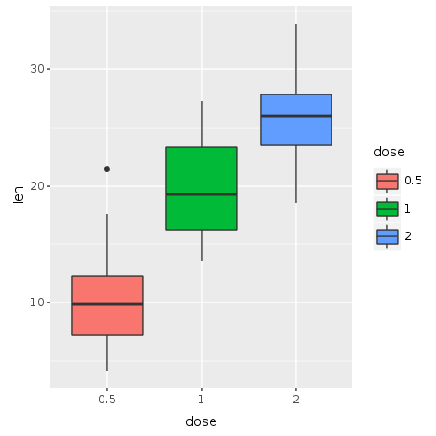
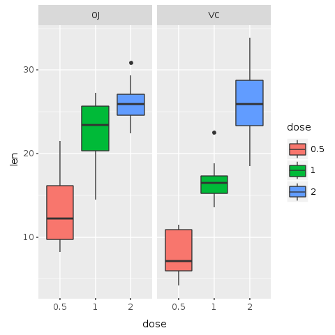
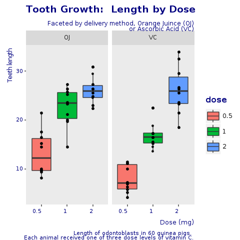

```{r setup, echo=FALSE}

```

# Introduction

According to Wikipedia "Ruby is a dynamic, interpreted, reflective, object-oriented, 
general-purpose programming language. It was designed and developed in the mid-1990s by Yukihiro
"Matz" Matsumoto in Japan."  It reached high popularity with the development of Ruby on Rails
(RoR) by David Heinemeier Hansson. RoR is a web application framework which was first release
circa 2005 and makes extensive use of Ruby's metaprogramming features.  With the advend of
RoR, Ruby became extremely popular and it peeked in popularity around 2008 according to the Tiobe
index (https://www.tiobe.com/tiobe-index/ruby/).  From 2008 to 2015, it's popularity
declined consistently and then started picking up again during the next 3 years.  At the time of
this writing (November 2018), Ruby is ranked 16th in the Tiobe index.

Python, considered a similar language to Ruby with similar features ranks 4th in the index.  The
first three positions are taken by Java, C and C++.  One criticism often heard about Ruby, is
that it is useful only for web applications while Python, with similar features, has more diverse
libraries, being useful for web applications with the Django framework, but also for
scientific applications such as statistics, data analysis, big data, biology, etc.  This
criticism is by no way wrong.  Although Ruby can do much more than just web applications:
https://github.com/markets/awesome-ruby, for scientific computing, Ruby lags
way behind Python and R, the
two most prestigous languages in the field, with R being prefered by statisticians
while Python by everyone else, because of it's gentle learning curve and more
"natural" programming paradigm.

Until recently, there was no real perspective for Ruby to bridge this gap and have even the
most basic scientific computing infrastructure.  Comes GraalVM into the picture:

     GraalVM is a universal virtual machine for running applications written in
     JavaScript, Python 3, Ruby, R, JVM-based languages like Java, Scala, Kotlin,
     and LLVM-based languages such as C and C++.

     GraalVM removes the isolation between programming languages and enables
     interoperability in a shared runtime. It can run either standalone or in the
     context of OpenJDK, Node.js, Oracle Database, or MySQL.

     GraalVM allows you to write polyglot applications with a seamless way to pass
     values from one language to another. With GraalVM there is no copying or
     marshaling necessary as it is with other polyglot systems. This lets you
     achieve high performance when language boundaries are crossed. Most of the time
     there is no additional cost for crossing a language boundary at all.

     Often developers have to make uncomfortable compromises that require them
     to rewrite their software in other languages. For example:

      * “That library is not available in my language. I need to rewrite it.” 
      * “That language would be the perfect fit for my problem, but we cannot
        run it in our environment.” 
      * “That problem is already solved in my language, but the language is
        too slow.”
    
    With GraalVM we aim to allow developers to freely choose the right language for
    the task at hand without making compromises.

As stated above, GraalVM is a _universal_ virtual machine that allows Ruby and R (and other
languages) to run on the same environment.  GraalVM allows polyglot applications to
_seamlessly_ interact with one another and pass values from one language to the other.  Based
on GraalVM, the Galaaz project was started.  Galaaz indends to tightly couple Ruby and R
and allow those languages to _seamlessly_ interact in a way that the user will be unaware
of such interaction.

Library wrapping is an usual way of bringing features from one language into another.
For instance, whenever Python needs to perform operations
efficiently, C libraries are wrapped in Python.
For the Python developer, the existence of such C library is of no concern.  The problem with
library wrapping is that for any new library of interest, there is the need to handcraft a new
wrapper.  With Galaaz, the same concept of wrapping was done, but instead of wrapping a
single C or R library, Galaaz wraps the whole of the R language in Ruby.  Doing so,
all thousands of R libraries
are immediately available to Ruby developers and any new library developed in R will also become
available without requiring a new wrapping effort.

In this article, the graphing ggplot2 library from R will be accessed by Ruby transparently,
bringing to Ruby the power of high quality scientific plotting.  It might seem, from
the exposed above, that Galaaz mainly benefits Ruby developers and might be of no
interest to the R developer.  This article will however show that migrating from R to
Ruby with Galaaz is a matter of small syntactic changes. Furthermore, Ruby's powerful OO
features are naturally available to the R developer, that can make use of them to move
the R code from the analysis fase to the production fase in a much easier and natural way.

In this article we will explore the R ToothGrowth dataset.  In doing so, we will
create some plots.
Furthermore we will create a "Corporate Template" for our plots ensuring that any plot of the
same type will have a consistent visualisation.

In https://towardsdatascience.com/ruby-plotting-with-galaaz-an-example-of-tightly-coupling-ruby-and-r-in-graalvm-520b69e21021 some other nice plots are shown with their respective Ruby code.

# gKnit

This document was written using rmarkdown and the corresponding HTML was generated by the gKnit
application.  gKnit is a wrapper around the powerful 'knitr' application which converts
rmarkdown text to many different output formats such as HTML, $LaTex$, docx, etc.  The gKnit
tool is still under active development and will soon be released.

In rmarkdown, text and code can be part of the same document, and code chunks are marked
with a special markup.  Interested readers can easily google 'knitr' and 'rmarkdown' for
more information on how to 'knit' a document. The 'knitr' application can knit not only R, but
also Python, Ruby and many other languages.  However, other than R, code chunks cannot
share data and variables.  In gKnit, this limitation is removed for Ruby chunks. Ruby
chunks can share data and variables and they can even access variables created in an R
chunk.  gKnit will be the subject of another blog to come. 

In gKnit each
Ruby chunk is executed in its own scope and thus, local variable are not accessible by other
chunks.  However, all chunks execute in the scope of a 'chunk' class and instance
variables ('@'), will be accessed by all chunks. 


# Exploring the Dataset

Let start by exploring our selected dataset.  ToothGrowth is
an R dataset.  For the Rubyist, a dataset is like an excel spreadsheet, but in which each
column has only one type of data, for instance, float, integer, string, etc.  This
dataset analyses the length of
odontoblasts (cells responsible for tooth growth) in 60 guinea pigs. Each animal
received one of three dose levels of Vitamin C (0.5, 1, and 2 mg/day) by one of two
delivery methods, orange juice or ascorbic acid (a form of vitamin C and coded as VC).

The ToothGrowth dataset is composed of three columns: 'len', 'supp' and 'dose'.  Let's
take a look at a few rows of this dataset. In Galaaz, in order to have access to an R
variable we use the
corresponding Ruby symbol preceeded by the tilda ('~') function.  Note in the following
chunk that Ruby's '@tooth_growth' gets assigned to '~:ToothGrowth', where 'ToothGrowth' is
an R variable containing the dataset of interest.

```{ruby head}
# Read the R ToothGrowth variable and assign it to the
# Ruby @tooth_growth variable is an instance variable
# available to all Ruby chunks in this document.
@tooth_growth = ~:ToothGrowth
# print the first few elements of the dataset
puts @tooth_growth.head
```

Great! We've managed to read the ToothGrowth dataset and take a look at its elements. We
see here the first 6 rows of the dataset.  The columns of the dataset can be accessed
by appending the column name to the dataset name separated by a '.', as if accessing an
instance variable from a class.  Also note that methods can be chained in the usual Ruby
stile with '.'. 

```{ruby dataset_columns}
# Access the tooth_growth 'dose' column and print the first few
# elements of this column with the 'head' method.
puts @tooth_growth.dose.head
```

The 'dose' column contains a numeric value wiht either, 0.5, 1 or 2.  Although those are
number, they are better interpreted as a factor or cathegory (https://swcarpentry.github.io/r-novice-inflammation/12-supp-factors/).  So, let's convert our 'dose' column from numeric to 'factor':

```{ruby tooth_growth}
# convert the dose to a factor
@tooth_growth.dose = @tooth_growth.dose.as__factor
```

Let's explore some more details of this dataset.  In particular, let's look at its dimensions,
structure and summary statistics.

```{ruby stats}
puts @tooth_growth.dim
@tooth_growth.str
puts @tooth_growth.summary
```

# Quick plot for seen the data

Let's now create our first plot with the given data by accessing ggplot2 from Ruby.  For Rubyist
that have never seen or used ggplot2, here is the description found on ggplot home page:

```
"ggplot2 is a system for declaratively creating graphics, based on _The Grammar of Graphics_.
You provide the data, tell ggplot2 how to map variables to aesthetics, what graphical 
primitives to use, and it takes care of the details."
```

This description might be a bit cryptic and it is best to see it at work to understand it.
Basically, in the _grammar of graphics_ each component of the plot such as the grid, the axis,
the data, title, subtitle, etc. is added to the plot in layers to form the final graphics.

In this plot bellow, the 'dose' is plotted on the 'x' axis and the tooth length on the 'y' axis.  Note
the specification in the the 'aes' method: 'E.aes(x: :dose, y: :len)',  where ':dose' is the 'dose'
column of the dataset and ':len' the 'len' column.  The 'aes' method is the _aesthetics_ for this
plot.  Then, to this layer, the 'geom_boxplot' is added and the whole plot is printed.

Note also that we have a call to 'R.png' before plotting and 'R.dev__off' after the print
statement.  'R.png' opens a 'png' device for writing the plot.  When 'R.dev__off' is called, the
device is closed and a 'png' file is created. If no name is given to the 'png' function, a file
named 'Rplot<nnn>' is generated, where <nnn> is the number of the plot.  So, this first plot is
called 'Rplot001.png'.  We can then include the generated 'png' file in
this document, by adding an rmarkdown directive.

```{ruby dose_len}
require 'ggplot'

R.png("figures/dose_len.png")

e = @tooth_growth.ggplot(E.aes(x: :dose, y: :len))
print e + R.geom_boxplot

R.dev__off
```

[//]: # (Including the 'png' file generated above.  In future releases)
[//]: # (of gKnit, the figures should be automatically saved and the name)
[//]: # (taken from the chunk 'label' and possibly chunk parameters)


We've just managed to generate our first plot in Ruby with only two lines of code.  This plot,
however, if far from being pleasing to the eye.  But, for a first analysis of the data, it
shows already a clear trend: as the dose of the supplement is increased, so is the length of
theeth.  Let's add some color to this plot, to make the trend more visible.  In the
following plot the boxes are color coded by dose.

```{ruby color_by_dose}
R.png("figures/color_by_dose.png")

@bp = @tooth_growth.ggplot(E.aes(x: :dose, y: :len, group: :dose)) + 
      R.geom_boxplot(E.aes(fill: :dose))
puts @bp

R.dev__off
```



Although we can see a trend and the plot is a little nicer to the eye, those plots do not
show any distinction between the two forms of supplement given to the pigs.  Let's then
create a new plot, but this time we will facet the plot by type of supplement.

```{ruby facets_by_supp}
R.png("figures/facets_by_supp.png")

# Split in vertical direction
@bp = @bp + R.facet_grid(+:all =~ +:supp)
puts @bp

R.dev__off
```



We now observe that administering vitamin C inpacts thooth growth a little bit differently when
the Vitamin C is administered by oranje juice (OJ) versus ascorbic acid (VC).  There is a
positive effect of the dosage, as the dosage increases the tooth growth increases.
In the specific case of the VC, the tooth growth has a linear relationship with dosage.
The higher dossage (2.0mg) has less improvement in tooth growth with the OJ supplement.
However, the OJ supplement generally induces more tooth growth than VC except at
higher dosage (2.0 mg).


```{ruby facets_with_decorations}
R.png("figures/facets_with_decorations.png")

# Split in vertical direction
@bp = @bp + R.geom_point 
puts @bp + R.labs(title: "Plot of length by dose",
                  x: "Dose (mg)", y: "Teeth length")

R.dev__off
```


```{ruby coorp_theme}
module CorpTheme

  #---------------------------------------------------------------------------------
  # face can be  (1=plain, 2=bold, 3=italic, 4=bold-italic)
  #---------------------------------------------------------------------------------
  
  def self.text_element(size, face = "plain")
    E.element_text(color: "#000080", 
                   face: face,
                   size: size,
                   hjust: 1)
  end
  
  #---------------------------------------------------------------------------------
  # Defines the plot theme (visualization).  In this theme we remove major and minor
  # grids, borders and background.  We also turn-off scientific notation.
  #---------------------------------------------------------------------------------
  
  def self.global_theme(faceted = false)
    
    R.options(scipen: 999)  # turn-off scientific notation like 1e+48
    
    # remove major grids
    gb = R.theme(panel__grid__major: E.element_blank())
    # remove minor grids
    gb = gb + R.theme(panel__grid__minor: E.element_blank)
    # gb = R.theme(panel__grid__minor: E.element_blank)
    # remove border
    gb = gb + R.theme(panel__border: E.element_blank)
    # remove background. When working with faceted graphs, the background makes
    # it easier to see each facet, so leave it
    gb = gb + R.theme(panel__background: E.element_blank) if !faceted
    # Change axis font
    gb = gb + R.theme(axis__text: text_element(8))
    # change axis title font
    gb = gb + R.theme(axis__title: text_element(10, "plain"))
    # change font of title
    gb = gb + R.theme(title: text_element(12, "bold"))
    # change font of subtitle
    gb = gb + R.theme(plot__subtitle: text_element(9, "plain"))
    # change font of captions
    gb = gb + R.theme(plot__caption: text_element(8))
    
  end
   
end
```

```{ruby final_plot}
R.png("figures/final_plot.png")

caption = <<-EOT
Length of odontoblasts in 60 guinea pigs. 
Each animal received one of three dose levels of vitamin C.
EOT

# Facet the plot by the s
@bp = @bp +
     R.labs(title: "Tooth Growth:  Length by Dose",
            subtitle: "Faceted by delivery method, Orange Juince (OJ)\n or Ascorbic Acid (VC)",
            x: "Dose (mg)", y: "Teeth length",
            caption: caption) +
     CorpTheme.global_theme(faceted: true)

puts @bp

# CorpTheme.layout("Plot of length by dose", "subtitle", bp)

R.dev__off
```



# Conclusion


# Installing Galaaz

## Prerequisites

* GraalVM (>= rc8)
* TruffleRuby
* FastR

The following R packages will be automatically installed when necessary, but could be installed prior
to using gKnit if desired:

* ggplot2
* gridExtra
* knitr

Installation of R packages requires a development environment and can be time consuming.  In Linux,
the gnu compiler and tools should be enough.  I am not sure what is needed on the Mac.

## Preparation

* gem install galaaz

## Usage

* gknit <filename>
