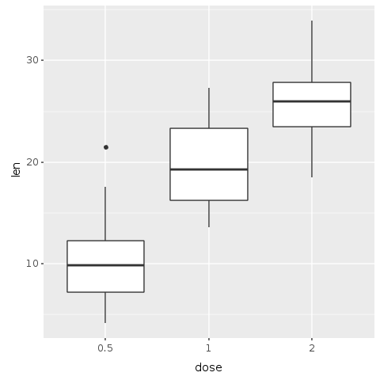
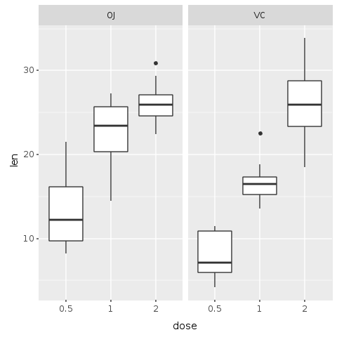
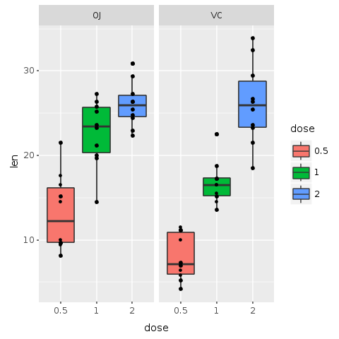
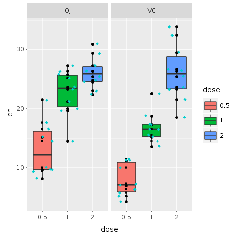
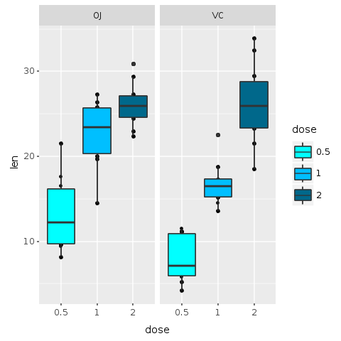
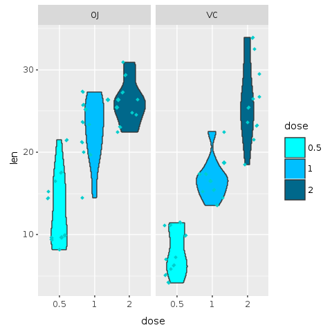
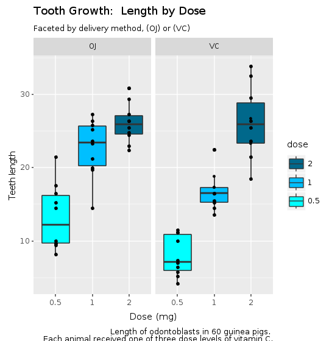
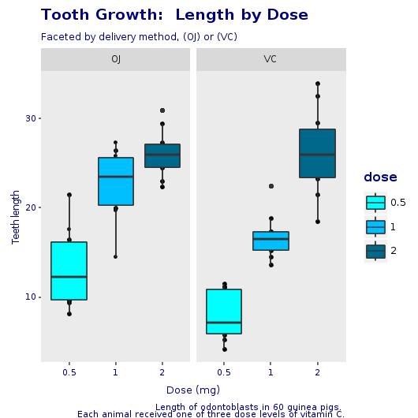
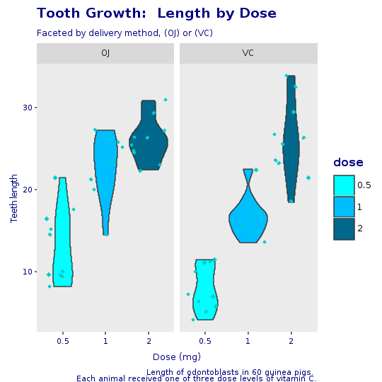
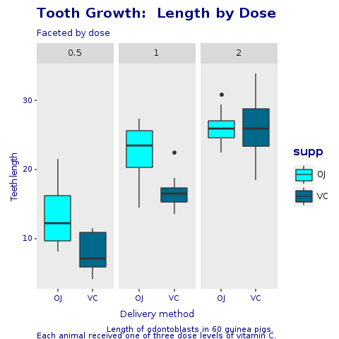

```{r setup, echo=FALSE}

```

# Introduction

According to Wikipedia "Ruby is a dynamic, interpreted, reflective, object-oriented, 
general-purpose programming language. It was designed and developed in the mid-1990s by Yukihiro 
"Matz" Matsumoto in Japan."  It reached high popularity with the development of Ruby on Rails
(RoR) by David Heinemeier Hansson. RoR is a web application framework first released
around 2005. It makes extensive use of Ruby's metaprogramming features.  With RoR,
Ruby became very popular.  According to [Ruby's Tiobe index](https://www.tiobe.com/tiobe-index/ruby/)
it peeked in popularity around 2008. Then it's popularity
declined until 2015 when it started picking up again.  At the time of
this writing (November 2018), the Tiobe index puts ruby in 16th position.

Python, a similar language to Ruby, ranks 4th in the index.  Java, C and C++ take the
first three positions.  Ruby is often criticized for its focus on web applications.
But Ruby can do [much more](https://github.com/markets/awesome-ruby) than just web applications.
Yet, for scientific computing, Ruby lags way behind Python and R.  Python has
Django framework for web, NumPy for numerical arrays, Pandas for data analysis.
R is a free software environment for statistical computing and graphics with thousands
of libraries for data analysis. 

Until recently, there was no real perspective for Ruby to bridge this gap.
Implementing a complete scientific computing infrastructure would take too long.
Comes GraalVM into the picture:

> GraalVM is a universal virtual machine for running applications written in
> JavaScript, Python 3, Ruby, R, JVM-based languages like Java, Scala, Kotlin,
> and LLVM-based languages such as C and C++.
>
> GraalVM removes the isolation between programming languages and enables
> interoperability in a shared runtime. It can run either standalone or in the
> context of OpenJDK, Node.js, Oracle Database, or MySQL.
>
> GraalVM allows you to write polyglot applications with a seamless way to pass
> values from one language to another. With GraalVM there is no copying or
> marshaling necessary as it is with other polyglot systems. This lets you
> achieve high performance when language boundaries are crossed. Most of the time
> there is no additional cost for crossing a language boundary at all.
>
> Often developers have to make uncomfortable compromises that require them
> to rewrite their software in other languages. For example:
>
>  * That library is not available in my language. I need to rewrite it. 
>  * That language would be the perfect fit for my problem, but we cannot
>    run it in our environment. 
>  * That problem is already solved in my language, but the language is
>    too slow.
>   
>  With GraalVM we aim to allow developers to freely choose the right language for
>  the task at hand without making compromises.

As stated above, GraalVM is a _universal_ virtual machine that allows Ruby and R (and other
languages) to run on the same environment.  GraalVM allows polyglot applications to
_seamlessly_ interact with one another and pass values from one language to the other.
Galaaz, a gem for Ruby, intends to tightly couple Ruby and R
and allow those languages to interact in a way that the user will be unaware
of such interaction.

Library wrapping is an usual way of bringing features from one language into another.
To improve performance, Python often wraps more efficient C libraries. For the
Python developer, the existence of such C libraries is of no concern.  The problem with
library wrapping is that for any new library, there is the need to handcraft a new
wrapper.

Galaaz, instead of wrapping a single C or R library, wraps the whole of
the R language in Ruby.  Doing so, all thousands of R libraries are available to
Ruby developers.  Also any new library developed in R will be available without a
new wrapping effort.

This article shows how Ruby can use R's ggplot2 library tranparantly, and 
bring to Ruby the power of high quality scientific plotting.  it also shows that
migrating from R to Ruby with Galaaz is a matter of small syntactic changes.
Using Ruby, the R developer can use all of Ruby's powerful OO features. It also
becomes much easier to move code from the analysis phase to the production phase.

In this article we will explore the R ToothGrowth dataset.  In doing so, we will
create some boxplots.  A primer on boxplot is available in 
[this article](https://towardsdatascience.com/understanding-boxplots-5e2df7bcbd51).

We will also create a Corporate Template ensuring that plots will have a consistent
visualization.  This template is build using a Ruby module.  There is a way of building
ggplot themes that will work the same as the Ruby module.  Yet, writing a new theme
requires specific knowledge.  Ruby modules are standard to the language and don't
need special knowledge.

In [this blog](https://towardsdatascience.com/ruby-plotting-with-galaaz-an-example-of-tightly-coupling-ruby-and-r-in-graalvm-520b69e21021) we show a scatter plot in Ruby also with Galaaz.

# gKnit

_Knitr_ is an application that converts text written in rmarkdown to many
different output formats.  For instance, a writer can convert an rmarkdown  document
to HTML, $LaTex$, docx and many other formats. Rmarkdown documents can contain
text and _code chunks_. Knitr formats code chunks in a grayed box in the output document.
It also executes the code chunks and formats the output in a white box.  Every line of
output from the execution code is preceded by '##'.

Knitr allows code chunks to be in R, Python,
Ruby and dozens of other languages.  Yet, while R and Python chunks can share data, in other
languages, chunks are independent.  This means that a variable defined in one chunk
cannot be used in another chunk.

With _gKnit_ Ruby code chunks can share data.  In gKnit each
Ruby chunk executes in its own scope and thus, local variable defined in a chunk are
not accessible by other chunks.  Yet, All chunks execute in the scope of a 'chunk'
class and instance variables ('@'), are available in all chunks.

# Exploring the Dataset

Let's start by exploring our selected dataset.  ToothGrowth is an R dataset.  A dataset
is like an excel spreadsheet, but in which each column has only one type of data.
For instance one column can have float, the other integer, and a third strings.
This dataset analyses the length of odontoblasts (cells responsible for tooth growth)
in 60 guinea pigs, where each animal received one of three dose levels of Vitamin C
(0.5, 1, and 2 mg/day) by one of two delivery methods, orange juice (OJ) or ascorbic acid
(a form of vitamin C and coded as VC).

The ToothGrowth dataset contains three columns: 'len', 'supp' and 'dose'.  Let's
take a look at a few rows of this dataset. In Galaaz, to have access to an R variable
we use the corresponding Ruby symbol preceeded by the tilda ('~') function. Note in the
following chunk that Ruby's '@tooth_growth' is assigned the value of '~:ToothGrowth'.
'ToothGrowth' is the R variable containing the dataset of interest.

```{ruby head}
# Read the R ToothGrowth variable and assign it to the
# Ruby instance variable @tooth_growth that will be 
# available to all Ruby chunks in this document.
@tooth_growth = ~:ToothGrowth
# print the first few elements of the dataset
puts @tooth_growth.head
```

Great! We've managed to read the ToothGrowth dataset and take a look at its elements.
We see here the first 6 rows of the dataset. To access a column, follow the dataset name
with a dot ('.') and the name of the column. Also use dot notation to chain methods
in usual Ruby style.

```{ruby dataset_columns}
# Access the tooth_growth 'len' column and print the first few
# elements of this column with the 'head' method.
puts @tooth_growth.len.head
```
 
The 'dose' column contains a numeric value wiht either, 0.5, 1 or 2.  Although those are
number, they are better interpreted as a [factor or cathegory](https://swcarpentry.github.io/r-novice-inflammation/12-supp-factors/).  So, let's convert our 'dose' column from numeric to 'factor'.
In R, the function 'as.factor' is used to convert data in a vector to factors.  To use this
function from Galaaz the dot ('.') in the function name is substituted by '__' (double underline).
The function 'as.factor' becomes 'R.as__factor' or just 'as__factor' when chaining.

```{ruby tooth_growth}
# convert the dose to a factor
@tooth_growth.dose = @tooth_growth.dose.as__factor
```

Let's explore some more details of this dataset.  In particular, let's look at its dimensions,
structure and summary statistics.

```{ruby dim}
puts @tooth_growth.dim
```

This dataset has 60 rows, one for each subject and 3 columns, as we have already seen.

Note that we do not call 'puts' when using the 'str' function.  This functions does not
return anything and prints the structure of the dataset as a side effect.

```{ruby str}
@tooth_growth.str
```
Observe that both variables 'supp' and 'dose' are factors.  The system made variable 'supp'
a factor automatically, since it contais two strings OJ and VC.

Finally, using the summary method, we get the statistical summary for the dataset

```{ruby summary}
puts @tooth_growth.summary
```

# Doing the Data Analysis

## Quick plot for seing the data

Let's now create our first plot with the given data by accessing ggplot2 from Ruby.  For Rubyist
that have never seen or used ggplot2, here is the description of ggplot found on its home page:

> "ggplot2 is a system for declaratively creating graphics, based on _The Grammar of Graphics_.
> You provide the data, tell ggplot2 how to map variables to aesthetics, what graphical 
> primitives to use, and it takes care of the details."

This description might be a bit cryptic and it is best to see it at work to understand it.
Basically, in the _grammar of graphics_ developers add layers of components such as grid,
axis, data, title, subtitle and also graphical primitives such as _bar plot_, _box plot_,
to form the final graphics.

In order to make a plot, we use the 'ggplot' function to the dataset.  In R, this would be
written as ```ggplot(<dataset>, ...)```.  In Galaaz, use either ```R.ggplot(<dataset>, ...)```,
or ```<dataset>.ggplot(...)```.  In the graph specification bellow, we use the second notation
that looks more Ruby like.  The plot specifies the 'dose' on the $x$ axis and the 'length' on
the $y$ axis with the 'aes' method. 'E.aes(x: :dose, y: :len)'.  To specify the type of plot to
create add a geom to the plot.  For a boxplot, the geom is R.geom_boxplot.

Note also that we have a call to 'R.png' before plotting and 'R.dev__off' after the print
statement.  'R.png' opens a 'png' device for outputting the plot.  'R.dev__off'
closes the device and creates the 'png' file. If we do no pass a name to the 'png' function, the
image gets a default name of 'Rplot\<nnn\>' where \<nnn\> is the number of the plot.  We can
then include the generated 'png' file in the document by adding an rmarkdown directive.

```{ruby dose_len}
require 'ggplot'

R.png("figures/dose_len.png")

e = @tooth_growth.ggplot(E.aes(x: :dose, y: :len))
print e + R.geom_boxplot

R.dev__off
```

[//]: # (Including the 'png' file generated above.  In future releases)
[//]: # (of gKnit, the figures should be automatically saved and the name)
[//]: # (taken from the chunk 'label' and possibly chunk parameters)



Great! We've just managed to create and save our first plot in Ruby with only
four lines of code. We can see with this plot a clear trend: as the dose of the supplement
is increased, so is the length of teeth.

## Facetting the plot

This first plot shows a trend, but our data has information about two different forms
of delivery method, either by Orange Juice (OJ) or by Vitamin C (VC).
Let's then try to create a plot that explicits the effect of each delivery method.  This next
plot is a _facetted_ plot where each delivery method gets is own plot.
On the left side, the plot shows the OJ delivery method.  On the right side, we see the
VC delivery method. To obtain this plot, we use the 'R.facet_grid' function, that
automatically creates the facets based on the delivery method factors.  The parameter to
the 'facet_grid' method is a [_formula_](https://thomasleeper.com/Rcourse/Tutorials/formulae.html).

In Galaaz, formulas are written a bit differently than in R.  The following changes are
necessary:

* R symbols are represented by the same Ruby symbol prefixed with the '+' method. The
  symbol ```x``` in R becomes ```+:x``` in Ruby;
* The '~' operator in R becomes '=~' in Ruby.  The formula ```x ~ y``` in R is written as
  ```+:x =~ +:y``` in Ruby;
* The '.' symbol in R becomes '+:all'

Another way of writing a formula is to use the 'formula' function with the actual formula as
a string.  The formula ```x ~ y``` in R can be written as ```R.formula("x ~ y")```.  For more
complex formulas, the use of the 'formula' function is preferred.

The formula ```+:all =~ +:supp``` indicates to the 'facet_grid' function that it needs to
facet the plot based on the ```supp``` variable and split the plot vertically.  Changing
the formula to ```+:supp =~ +:all``` would split the plot horizontally.

```{ruby facet_by_delivery}
R.png("figures/facet_by_delivery.png")

@base_tooth = @tooth_growth.ggplot(E.aes(x: :dose, y: :len, group: :dose))

@bp = @base_tooth + R.geom_boxplot +
      # Split in vertical direction
      R.facet_grid(+:all =~ +:supp)
      
puts @bp

R.dev__off
```



It now becomes clear that although both methods of delivery have a direct
impact on tooth growth, method (OJ) is non-linear having a higher impact with smaller
doses of ascorbic acid and reducing it's impact as the dose increases.  With the
(VC) approach, the impact seems to be more linear.

## Adding Color

If this paper was about data analysis, we should make a better analysis of the trends and
should improve the statistical analysis.  But we are interested in working with ggplot
in Ruby.  So, Let's add some color to this plot to make the trend and comparison more
visible.  In the following plot, the boxes are color coded by dose.  To add color, it is
enough to add ```fill: :dose``` to the aesthetic of boxplot.  With this command each 'dose'
factor gets its own color.

```{ruby facets_by_delivery_color}
R.png("figures/facets_by_delivery_color.png")

@bp = @bp + R.geom_boxplot(E.aes(fill: :dose))
puts @bp

R.dev__off
```


Facetting helps us compare the general trends in the (OJ) and (VC) delivery methods.
Adding color allow us to compare specifically how each dosage impacts the teeth growth.
It is possible to observe that with smaller doses, up to 1mg, (OJ) performs better
than (VC) (red color). For 2mg, both (OJ) and (VC) have the same median, but (OJ) is
less disperse (blue color).
For 1mg (green color), (OJ) is significantly bettern than (VC). By this very quick analysis,
it seems that (OJ) is a better delivery method than (VC).

## Clarifying the data

Boxplots give us a nice idea of the distribution of data, but looking at those plots with
large colored boxes leaves us wondering what is going on on those boxes.  According to
Edward Tufte in Envisioning Information:

> Thin data rightly prompts suspicions: "What are they leaving out? Is that really everything
> they know? What are they hiding? Is that all they did?" Now and then it is claimed
> that vacant space is "friendly" (anthropomorphizing an inherently murky idea) but
> _it is not how much empty space there is, but rather how it is used. It is not how much
> information there is, but rather how effectively it is arranged._

And he states:

> A most unconventional design strategy is revealed: _to clarify, add detail._

Let's then use this wisdom and add yet another layer of data to our plot, so that we clarify
it with detail and do not leave large empty boxes.  In this next plot, we add data points for
each of the 60 pigs in the experiment.  For that, add the function 'R.geom_point' to the
plot.

```{ruby facets_with_points}
R.png("figures/facets_with_points.png")

# Split in vertical direction
@bp = @bp + R.geom_point

puts @bp

R.dev__off
```



Now we can see the actual distribution of all the 60 subject.  Actually, this is not
totally true.  We have a hard time seing all 60 subjects. It seems that some points
might be placed one over the other hiding useful information.

But no sweat! Another layer might solve the problem.  In the following plot a new layer
called 'geom_jitter' is added to the plot.  This adds randomness to the position of
the points, making it easier to see all of then and preventing data hiding.  We also add
color and change the shape of the points, making them even easier to see.

```{ruby facets_with_jitter}
R.png("figures/facets_with_jitter.png")

# Split in vertical direction
puts @bp + R.geom_jitter(shape: 23, color: "cyan3", size: 1)

R.dev__off
```



Now we can see all 60 points in the graph. We have here a much higher information density
and we can see outliers and subjects distribution.

# Preparing the Plot for Presentation

We have come a long way since our first plot.  As was already said, this is not
an article about data analysis and the focus is on the
integration of Ruby and ggplot.  So, let's assume that the analysis is now done.  Yet,
ending the analysis does not mean that the work is done.  On the contrary, the hardest
part is yet to come!

After the analysis it is necessary to communicate it by making a final plot for
presentation.  The last plot has all the information we want to share, but it is not very
pleasing to the eye.

## Improving Colors

Let's start by trying to improve colors.  For now, we will not use the jitter layer.
The previous plot has three bright colors that have no relashionship between them.  Is
there any obvious, or non-obvious for that matter, interpretation for the colors?
Clearly, they are just random colors selected automatically by our software.  Although
those colors helped us understand the data, for a final presentation random colors
can distract the viewer.

In the following plot we use shades function 'scale_fill_manual' to change
the colors of the boxes and order of labels.  For colors we use shades of blue for
each dosage, with light blue ('cyan')
representing the lower dose and deep blue ('deepskyblue4') the higher dose. Also
the smaller value (0.5) is on
the botton of the labels and (2) at the top.  This ordering seems more natural and
matches with the actual order of the colors in the plot.

```{ruby facets_by_delivery_color2}
R.png("figures/facets_by_delivery_color2.png")

@bp = @bp +
      R.scale_fill_manual(values: R.c("cyan", "deepskyblue", "deepskyblue4"),
                          breaks: R.c("2","1","0.5"))

puts @bp

R.dev__off
```




## Violin Plot and Jitter

The boxplot with jitter did look a bit overwhelming.  The next plot uses a variation of
a boxplot known as a _violin plot_ with jittered data.

[From Wikipedia](https://en.wikipedia.org/wiki/Violin_plot)


> A violin plot is a method of plotting numeric data. It is similar to a box plot with
> a rotated kernel density plot on each side.
> 
> A violin plot has four layers. The outer shape represents all possible results, with
> thickness indicating how common. (Thus the thickest section represents the mode average.)
> The next layer inside represents the values that occur 95% of the time.
> The next layer (if it exists) inside represents the values that occur 50% of the time.
> The central dot represents the median average value. 

```{ruby violin_with_jitter}
R.png("figures/violin_with_jitter.png")

@violin = @base_tooth + R.geom_violin(E.aes(fill: :dose)) + 
   R.facet_grid(+:all =~ +:supp) +
   R.geom_jitter(shape: 23, color: "cyan3", size: 1) +
   R.scale_fill_manual(values: R.c("cyan", "deepskyblue", "deepskyblue4"),
                       breaks: R.c("2","1","0.5"))

puts @violin

R.dev__off
```



This plot is an alternative to the original boxplot.  For the final presentation, it is
important to think which graphics will be best understood by our audience. A violin plot
is a less known plot and could add mental overhead, yet, in my opinion, it does look a lit
bit better than the boxplot and provides even more information than the boxplot with jitter.

## Adding Decoration

Our final plot is starting to take shape, but a presentation plot should have at least a
title, labels on the axis and maybe some other decorations.  Let's start adding those.
Since decoration requires more graph area, this new plot has a 'width' and 'height'
specification.  When there is no specification, the default values for width and height are
480.

The 'labs' function adds require decoration.  In this example we use 'title', 'subtitle',
'x' for the $x$ axis label and 'y', for the $y$ axis label, and 'caption' for information
about the plot.

```{ruby facets_with_decorations}
R.png("figures/facets_with_decorations.png", width: 540, height: 560)

caption = <<-EOT
Length of odontoblasts in 60 guinea pigs. 
Each animal received one of three dose levels of vitamin C.
EOT

@decorations =
  R.labs(title: "Tooth Growth:  Length by Dose",
         subtitle: "Faceted by delivery method, (OJ) or (VC)",
         x: "Dose (mg)", y: "Teeth length",
         caption: caption)

puts @bp + @decorations

R.dev__off
```




## The Corp Theme

We are almost done.  But the plot does not yet look nice to the eye. We are still distracted
by many aspects of the graph.  First, the back font color does not look good.  Then
plot background, borders, grids all add clutter to the plot.

We will now define our corporate theme.  In this theme, we remove borders and grids.  The
background if left for faceted plots but removed for non-faceted plots.  Font colors are
a shade o blue (color: '#00080').  Axis labels are moved near the end of the axis and
written in 'bold'.

```{ruby coorp_theme}
module CorpTheme

  R.install_and_loads 'RColorBrewer'
  
  #---------------------------------------------------------------------------------
  # face can be  (1=plain, 2=bold, 3=italic, 4=bold-italic)
  #---------------------------------------------------------------------------------
  
  def self.text_element(size, face: "plain", hjust: nil)
    E.element_text(color: "#000080", 
                   face: face,
                   size: size,
		   hjust: hjust)
  end
  
  #---------------------------------------------------------------------------------
  # Defines the plot theme (visualization).  In this theme we remove major and minor
  # grids, borders and background.  We also turn-off scientific notation.
  #---------------------------------------------------------------------------------
  
  def self.global_theme(faceted = false)
    
    R.options(scipen: 999)  # turn-off scientific notation like 1e+48
    #    R.theme_set(R.theme_bw)
    
    # remove major grids
    gb = R.theme(panel__grid__major: E.element_blank())
    # remove minor grids
    gb = gb + R.theme(panel__grid__minor: E.element_blank)
    # gb = R.theme(panel__grid__minor: E.element_blank)
    # remove border
    gb = gb + R.theme(panel__border: E.element_blank)
    # remove background. When working with faceted graphs, the background makes
    # it easier to see each facet, so leave it
    gb = gb + R.theme(panel__background: E.element_blank) if !faceted
    # Change axis font
    gb = gb + R.theme(axis__text: text_element(8))
    # change axis title font
    gb = gb + R.theme(axis__title: text_element(10, face: "bold", hjust: 1))
    # change font of title
    gb = gb + R.theme(title: text_element(12, face: "bold"))
    # change font of subtitle
    gb = gb + R.theme(plot__subtitle: text_element(9))
    # change font of captions
    gb = gb + R.theme(plot__caption: text_element(8))

  end
   
end
```

## Final Box Plot

Here is our final boxplot, without jitter.

```{ruby final_box_plot}
R.png("figures/final_box_plot.png", width: 540, height: 560)

puts @bp + @decorations + CorpTheme.global_theme(faceted: true)

R.dev__off
```



## Final Violin Plot

Here is the final violin plot, with jitter and the same look and feel of the corporate
boxplot.

```{ruby final_violin_plot}
R.png("figures/final_violin_plot.png", width: 540, height: 560)

puts @violin + @decorations + CorpTheme.global_theme(faceted: true)

R.dev__off
```



## Another View

Finally, here is a last plot, with the same look and feel as before but facetted by
dose and not by supplement.

```{ruby facet_by_dose}
R.png("figures/facet_by_dose.png", width: 540, height: 560)

caption = <<-EOT
Length of odontoblasts in 60 guinea pigs. 
Each animal received one of three dose levels of vitamin C.
EOT

@bp = @tooth_growth.ggplot(E.aes(x: :supp, y: :len, group: :supp)) + 
      R.geom_boxplot(E.aes(fill: :supp)) + R.facet_grid(+:all =~ +:dose) +
      R.scale_fill_manual(values: R.c("cyan", "deepskyblue4")) +
      R.labs(title: "Tooth Growth:  Length by Dose",
             subtitle: "Faceted by dose",
             x: "Delivery method", y: "Teeth length",
             caption: caption) +
      CorpTheme.global_theme(faceted: true)
puts @bp

R.dev__off
```



# Conclusion

Galaaz tightly couples Ruby and R in a way that Ruby developers do not need to be aware
of the executing R engine.  For the Ruby developer the existence of R
is of no consequence.  For her, she is just coding in Ruby.  On the other hand, for the R
developer, migration to Ruby is a matter of small syntactic changes and very gentle
learning curve. As the R developer becomes more proficient in Ruby, he can start using
'classes', 'modules', 'procs', 'lambdas'.  

This coupling shows the power of GraalVM and Truffle polyglot environment.  Trying to
bring to Ruby the power of R starting from scratch is an enourmous endeavour and would
probably never be accomplished.  Today's data scientists would certainly stick with either
Python or R.  Now, both the Ruby and R communities might benefit from this marriage.  Also,
the process to couple Ruby and R can be also be done to couple Ruby and JavaScript and
maybe also Ruby and Python.  In a polyglot world a *uniglot* language might be extremely
relevant.

From the perspective of performance, GraalVM and Truffle promises improvements that could
reach over 10 times, both for [FastR](https://medium.com/graalvm/faster-r-with-fastr-4b8db0e0dceb)
and for [TruffleRuby](https://rubykaigi.org/2018/presentations/eregontp.html).

This article has shown how to improve a plot step-by-step.  Starting from a very simple
boxplot with all default configurations, we moved slowly to our final plot.  The important
point here is not if the final plot is actually beautiful, but that there is a process
of small steps improvements that can be followed until getting a final plot ready for
presentation.

Finally, this whole article was written in rmarkdown and compiled to HTML by _gknit_, an
application that wraps _knitr_ and allows documenting Ruby code.  This application can
be of great help for any Rubyist trying to write articles, blogs or documentation for Ruby.


# Installing Galaaz

## Prerequisites

* GraalVM (>= rc8): https://github.com/oracle/graal/releases
* TruffleRuby
* FastR

The following R packages will be automatically installed when necessary, but could be installed prior
to using gKnit if desired:

* ggplot2
* gridExtra
* knitr

Installation of R packages requires a development environment and can be time consuming.  In Linux,
the gnu compiler and tools should be enough.  I am not sure what is needed on the Mac.

## Preparation

* gem install galaaz

## Usage

* gknit <filename>
* In a scrip add: require 'galaaz'


And now that you’ve read this far, here’s how to submit your story to the freeCodeCamp
publication: send an email to submit at freecodecamp org. Include the URL for your story on
Medium (preferably an unpublished draft) and the word “bananas” so that we’ll know that you
have read all this. Only send one story URL per email. There’s no need to add anything
further to your email — we just read the stories and judge them based on their own merits.